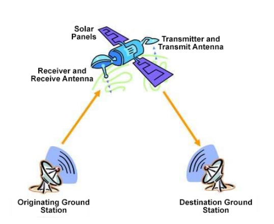
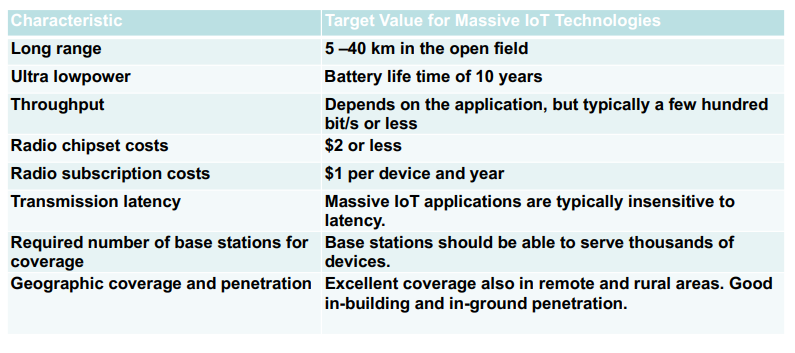
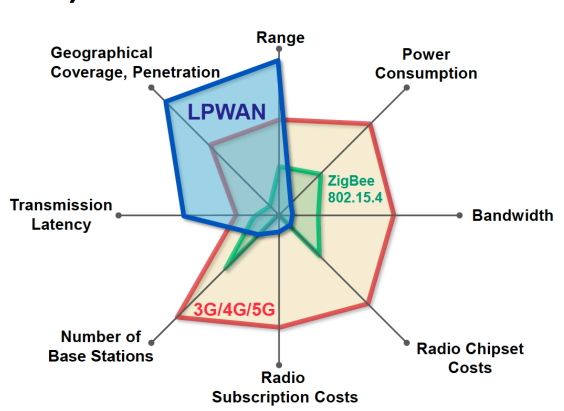
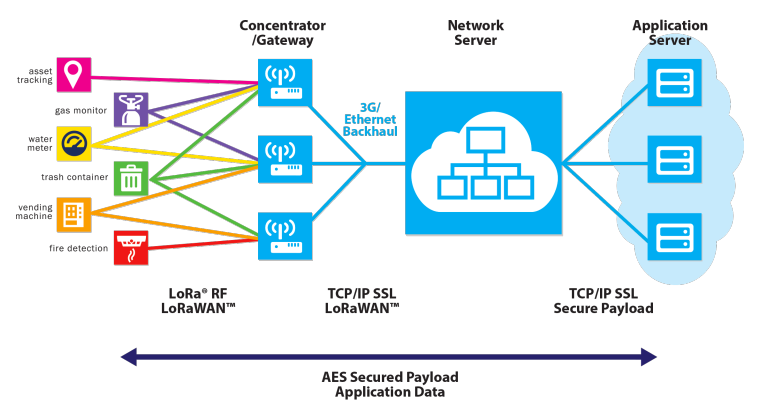
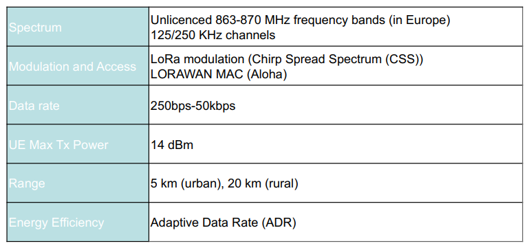
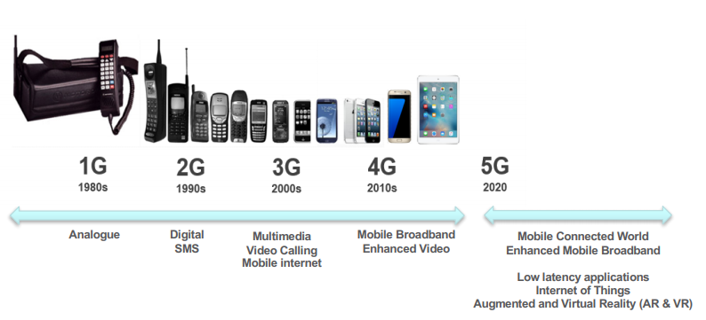

# Wireless Communications 2

## Satellite Networks

### Satellite Networks and Applications

- More than 8,900 satellites have been launched, serving different applications
- Universal Coverage, limited data rate, costly

### How do Satellites Work?
- A Communication Satellite contains several transponders
which listens to some portion of spectrum, amplifies the
incoming signal and broadcasts it in another frequency to
avoid interference with incoming signals.

- When two Stations on Earth want to communicate through
radio broadcast they can use a satellite as a relay station
for their communication.

- One Earth Station sends a transmission to the satellite.
This is called a Uplink.

- The satellite Transponder converts the signal and sends
it down to the second earth station. This is called a
Downlink.

### Basic Concept

### Satellite Service Types
- Fixed Service Satellites (FSS)
    - Example: Point to Point Communication
- Broadcast Service Satellites (BSS)
    - Example: Satellite Television/Radio
    - Also called Direct Broadcast Service (DBS).
- Mobile Service Satellites (MSS)
    - Example: Satellite Phones

### Frequency Bands
- Different kinds of satellites use different frequency bands.
    - L–Band: 1 to 2 GHz, used by MSS
    - S-Band: 2 to 4 GHz, used by MSS, NASA, deep space research
    - C-Band: 4 to 8 GHz, used by FSS
    - X-Band: 8 to 12.5 GHz, used by FSS and in terrestrial imaging, ex: military and meteorological satellites
    - Ku-Band: 12.5 to 18 GHz: used by FSS and BSS (DBS)
    - K-Band: 18 to 26.5 GHz: used by FSS and BSS
    - Ka-Band: 26.5 to 40 GHz: used by FSS 

## Types of Satellites

Satellite Orbits
- GEO
- LEO
- MEO

### Geostationary Earth Orbit (GEO)

- GEO satellites are synchronous with respect to earth.
Looking from a fixed point from Earth, these satellites
appear to be stationary.

- There are three conditions which lead to geostationary
satellites.

1. The satellite should be placed 35,786 kms (approximated
to 36,000 kms) above the surface of the earth.
2. These satellites must travel in the rotational speed of earth,
and in the direction of motion of earth, that is eastward.
3. The inclination of satellite with respect to earth must be 00

### Low Earth Orbit (LEO)

- LEO satellites are placed 500-1500 kms above the surface of
the earth.

- As LEOs circulate on a lower orbit, hence they exhibit a much
shorter period that is around 90 minutes.

- These satellites are mainly used in remote sensing and
providing mobile communication services.

- The biggest problem of the LEO concept is the need for many
satellites if global coverage is to be reached.

- One general problem of LEOs is the short lifetime of about
five to eight years due to atmospheric drag and radiation

## Medium Earth Orbit (MEO)

- A MEO satellite is in orbit somewhere between 8,000 km and
18,000 km above the earth’s surface.

- MEO satellites are similar to LEO satellites in functionality.

- MEO satellites orbital period range from about 2 to nearly 24
hours and they have a larger coverage area than LEO
satellites.

- A MEO satellite’s longer duration of visibility and wider
footprint means fewer satellites are needed in a MEO network
than a LEO network.

- A MEO satellite’s distance gives it a longer time delay and
weaker signal than a LEO satellite, though not as bad as a
GEO satellite.

## SpaceX’s Starlink

- Starlink plans to put 1584 satellites in an orbit just 550 kilometers about the surface of the Earth

- it should shorten the
amount of time it takes to
send and receive a signal
from the satellites
    - ping time could be as low as 15 milliseconds, the company estimated
- Starlink Broadband Service Will Begin in 2020

### Basics: Advantages of Satellites

**The advantages of satellite communication over terrestrial communication are:**

- The coverage area of a satellite greatly exceeds that
of a terrestrial system.

- Transmission cost of a satellite is independent of the
distance from the center of the coverage area.

- Satellite to Satellite communication is very precise.

- Higher Bandwidths are available for use.

### Basics: Disadvantages of Satellites

**The disadvantages of satellite communication:**
- Launching satellites into orbit is costly.
- Satellite bandwidth is gradually becoming used up.
- Per bit cost of the transmission is very expensive.
- There is a larger propagation delay in satellite communication than in terrestrial communication.

## Mobile Broadband Networks

### Mobile Broadband (MBB) Networks

Mobile networks (e.g. 3G/4G)
- Underpins a lot of vital operations of the modern society
    - Extended coverage
    - Mobility
    - Security

### Macro View
Building Blocks of MBB Networks
- Radio Access Network
- Core Network

### Home Subscriber Service (HSS)

- Central database that contains information about all the network operators subscribers.

- Contains the subscription related information (subscriber profiles).

- Performs authentication and authorization of the user.

- Provides information about the subscriber’s location and IP.

### Mobility Management Entity (MME)

- Mobility Management: One of the most complex functions MME
performs. Providing seamless inter-working has multiple use cases
such as Inter-eNB and Inter-RAT, among others.

- Roaming Management: MME supports outbound and inbound
roaming subscribers from other LTE/EPC systems and legacy
networks.

- Radio Resource Management: MME works with the HSS and the
RAN to decide the appropriate radio resource management
strategy (RRM) that can be UE-specific.

- UE Reachability: MME manages communication with the UE and
HSS to provide UE reachability and activity-related information.

- Lawful Intercept: Since MME manages the control plane of the
network, MME can provide the whereabouts of a UE to a law
enforcement monitoring facility.

## Serving Gateway (S-GW)
- Acts like a high level router
    - Routes and forwards data packets from eNodeBs to PDN-GW

### Packet Data Network Gateway (PDN-GW)

- Point of contact with the outside world
    - Connects the UE to external packet data networks
    - point of exit and entry of traffic for the UE

- The PDN-GW performs:
    - policy enforcement
    - packet filtering and screening per user
    - lawful Interception

### Policy and Charging Rule Function (PCRF)

How a certain packet is delivered to a certain user
considering the QoS and charging?

- QoS: Differentiation of subscribers and services
- Charge subscribers based on their volume of usage of high-bandwidth applications
- Charge extra for QoS guarantees
- Limit app usage while a user is roaming
- Lower the bandwidth of wireless subscribers using heavy-bandwidth apps during peak usage times.

### Massive IoT

### Key Challenges for Massive IoT

- **Battery life** – many IoT devices will be battery-powered, and
often the cost of replacing batteries in the field is not viable.

- **Coverage and Range** – deep indoor connectivity is a
requirement for many applications in the utility area. Regional
(or even national or global) coverage is a prerequisite for
many use cases, especially within the transport area.

- **Quality of Service** – providing a certain low bitrate reliably is important for many applications while latency is not that critical.

- **Deployment and device cost** – clearly a key enabler for
high-volume, mass-market applications, enabling many of the
use cases. Moreover, in order to enable a Massive IoT
market, networks need to scale efficiently.

### Characteristics and requirements of massive IoT applications

### Low Power Wide Area Networks (LPWAN)

### LONG RANGE WIDE AREA NETWORK (LORAWAN)

#### What is LORAWAN?
- Low Power, Wide Area (LPWA) networking protocol for IoT
- Provides bi-directional communication, end-to-end security,
mobility and localization services
- Open source standard
- Unlicensed band (EU 868)
- LORA Alliance (400+ industry partner)
- The Things Network (TTN)*: “a global, crowdsourced, open, free and decentralized LoRaWAN IoT platform”

### LoRaWAN Architecture

### LoRaWAN Specification

### Adaptive Data Rate (ADR)

- Adaptive Data Rate (ADR) is a mechanism for optimizing data
rates, airtime and energy consumption in the network.

- Spreading Factor (SF): is the duration of the
chirp. LoRa operates with spread factors from 7 to 12. SF7
is the shortest time on air, SF12 will be the longest.
- ADR triggers:
    I. SF increase (device-side)
        - Improves message delivery in harsh radio conditions
    II. SF decrease (network-side) 
        - Improves data rate and power consumption

### NARROW BAND IOT (NB-IOT)

### What is NB-IoT?

- LPWAN radio technology standard developed by 3GPP to meet IoT application requirements.

- Builds on the LTE ecosystem, and can be deployed as a simple addition of new software to existing LTE infrastructure.
    - leading to fast development, scalability, and global roaming

- Includes state-of-the-art LTE security
    - Identity management
    - Authentication and authorization (embedded SIM)
    - End to end encryption of device data and signalling

- Future feature growth for MBB and NB-IoT use cases

### NB-IoT Coverage

**Coverage Enhancement (CE) Techniques (w.r.t. LTE)**
- Power Spectral Density boost: Tx power focused on smaller bands
- Repetitions: messages can be repeated up to 128 times

### What is 5G?
5G is the 5th generation of mobile networks

### New for 5G – RAN architecture extensions

#### New Air Interface
- Massive MIMO – large numbers of bearers to increase bandwidth in sub-6GHz bands
- mmWave – provides access to broad frequency bands for higher bandwidths
- Beam Forming – extends range/cell size for mmWave bands
- Flexibility in band sizing – allows previously unavailable bands to be used

#### Other RAN innovations
- Small cell support – greater indoor coverage, increased cell density, self-backhauling
- 5G-NR in unlicensed bands – extension of mobile ecosystem
- Session management split from mobility management – enabler for RAN slicing
- D2D, V2X – devices connecting directly, with no network