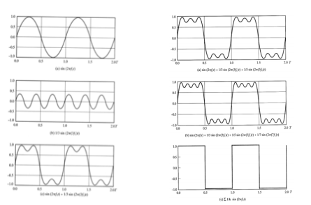
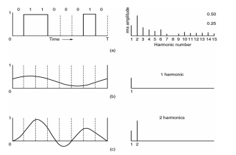
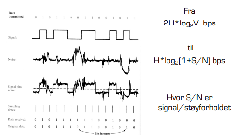

# Fysiske laget

## Øverføringskapaistet

### Faktorer som påvirker kvalitet og kapasitet
- Forvrengning av signal gjennom medier.Det som sendes over linja er ikke helt det samme som kommer frem.

- Samplingsrate. Hvor ofte sampler datamaskinen (leser av fenomenet)
- Støy. Andre kilder som sender noe

- Frekvens

## Dekomponering av et signal

- Harmoniske signaler
    - For vør frekvens som legges på så ligner bølgene mer og mer på den ønskede formen.

    - Enhver frekvensform/bølgeform kan skrives som en sum av harmoniske signaler.

## Fouriereranalyse 
Et binært signal og dets Fourier Analyse

Ethvert signal kan skrives som summen av en (muligens uendelig) rekke av "harmoniske signaler".

## Hva har dette med data-kommunikasjon å gjøre
- Alle medeia svekker signalstyrken.
- De forskjellige harmoniske signalene (frekvensene) svekkes forskjellig - høyere frekvenser har høyere svekkelse.
- Den delen av spekteret som ikke svekkes vesentlig kalles mediets båndbredde.
    - Denne delen går typisk fra 0 og opp i en øvre grense.
    - Den øvre grensen er ikke skarp.
- Båndbredde er bredden av frekvenser som kan brukes til å kommunisere over et gitt medie
- Jo flere bit du forsøker å sendei sekundet, jo færre harmoniske signaler får du plass til før du komer utenom båndbredde spekteret.
- Dette betyr at jo flere bit du forsøker å sende, jo vanskeligere blir det å lese signalet hos mottaker.

## Nyquist teorem
Nyquist studerte hvordan du kunne lese signalet npr det kom frem:

"Desom øvre grense i båndbredder er H, holder det å lese av ("sample") med frekvens 2H for  å avlese det innkommende signalet feilfritt hos mottaker."

- Av dette kan man avlede at dersom kanalen er "perfekt" fra frekvensen H og nedover, kan man maksimalt overføre 2H*log2V bit per sekund over kanalen.
    - V er her antall diskrete nivåer i signalet.
    - Husk at selv om det er bits som overføres, kan det være flere en to nivåer som avleses. Ved fire nivåer avleses ved hvert sampel t tall mellom 0 og 3, som så kan oversettes til to bit.

## Nyquist teorem 2
Nyquist satte en øvre grense på 2H*log2V bit per sekund i en perfekt kanal.
- Med andre ord, en binær kanal (hvor V=2) på 3000 Hz kunne maksimalt overføre 6000 bit per sekund.
- ... men bare ved å sette V høyt nok, synes det som om vi kan overføre sp mange bps man vil...?

Nyquist teorem sier noe om hvor mange bits per sekund man får igjennom en perfekt kanal.

## Effekten av støy - Shannons teorem

Shannon utvidet på Nyquist med at regnestykket endrer seg når man tar med støy i kanalen i regnestykket.

## Shannons teorem

## Oppsummert

**Fourier**
Det er bare et hvist antall frekvenser som kommer "relativt uhindret" gjennom kanalen, og det beskriver forvrengningen gjennom kanalen.

**Nyquist**
Joda, Fourier, men du kan likevel få igjennom veldig mye data ved å avlese mange nivåer desom kanalen er perfekt innenfor de frekvensene som faktisk virker.

**Shannon**
Riktig det, Nyquist, men det vil alltid være et signal/støyforhold, som i siste instans setter grenser for hvor mye data som kommer feilfritt frem.

- Fourier, Nyquist og Shannon har relevans for alle kjente transmisjonsteknikker:
- Magnetiske media
- Kobber kabler
- Optiske kabler
- Infrarøde signaler
- Radiosignaler

- For enhver teknologi vil slike ting som rekkevidde, maks kabellengde, og maks bitrate henge sammen på en måte som i siste istans er bestemt av deres lover.

## Båndbredde

**Baseband**
- Antar du er alene (kabel)
**Passband**
- Frekvensintervall som er isolert for en spesifik formål (Nødvendig for wifi)

## Binær koding
Hvordan koder vi 0 og 1. Binær koding er det enkleste måten å kode 0 og 1 i signaler.
**(NRZ) Non return to zero**
- "1" høyspening
- "0" lav spenning

i.e

+ enkel og billig
+ god bruk av båndbredde
- ingen enkel klokkesykronisering

Under 1 Gb pr sekund er det vanskelig å ha nøyaktige nok klokker til å holde to kommuniserende maskiner i synk.

**Non return to zero inverted**
- "1" endre spenning
- "0" ingen endring i spenning

+ enkel
+ 1 bit per symbol
- ingen klokkesynkronisering (lange sekvenser av 0)

**løsning: 2B5B koding**
Koder 4 bit som 5 bit på en slik måte at det aldri er mer enn to 0-bit etter hverandre.

### Machester encoding

bit intervalet deles i 2
- "1" faseskift fra høy til lav
- "0" faseskift fra lav til lav til høy

+ enkel klokke synkronisering
+ enkel og billig å produsere
+ robust design
- Halvparten av mulig bitfrekvens

### Differenetail Mancherster encoding
Samme ide som Manchester Enkoding, men:
- "1": ingen nivåendring ved starten av intervallet
- "0": nivåendring ved starten av intervallet

## Passband/Frequency Division Multiplexing
- binært signal
- amplitued modulasjon
- frekevens modulasjon
- fase modulasjoner

### Observasjoner
- NRZ gir problemer med klokkesynkronisering
- Manchester koding krever dobbel båndbredde (Men ble bruk i eldre Ethernet)
- NRZI gjør at lange sekvenser med 1 ikke gir noe problem, men det gjør lange sekvenser med 0. Dette kan løses med 4B/5B koding.
- I Passband kan amplitudemodulasjon, frekvensmodulasjon og fasemodulasjon benyttes.

# Link laget

## Internettets overlay arkitektur

Internett rutere ble skapt for å skape internett abstraksjonen.
Stilte minimale krav til IP link protokollen pga fragmentert nettverks oppsett hos forksjellige aktører/nettverk.

**Enkelt å bygge IP linker på toppen av andre nettverks stacks**

## Link typer
- punkt til punkt (enkel kabel)
- broadcast link (delt kabel/trådløs)
- Svitsjet (feks: svitches Ethernet)

## Linklagets tjenester

### Framing og linkaksess
- Pakke data inne i en ramme (frame) og legge til hode og hale.
- Implementere kanalaksess dersom det er delt medium.
- "Fysiske adresser" blir brukt i rammeheaderene til å identifisere kilde og destinasjon når det er delt medium.

### Pålitelig levering
- Sjelden brukt i fiberoptikk, co-axial kabel og noen varianter av twisted pair pga. lav feil rate.
- Brukt på trådløslinker hvor målet er å redusere feil, og unngå ende til ende retransmisjoner.

### Flytkontroll
- Hastighetsavpassing mellom sender og mottaker

### Feildeteksjon
- Feil kommer av støy og signalreduksjon
- Mottaker oppdater feil i motatt ramme.
- Den signalerer for retransmisjon, eller den bare kaster rammen.

### Feilkorreksjon
- Mekanisme hvor mottakeren retter feilen uten å be om retransmisjon

## Feilfinning og feilretting

Oppgaver
1. Finne feil
2. Rette feil - to alternativer til å rette feil:
 - Han nok informasjon til å rette opp de mottatte dataene.
 - Be om data(rammen) blir sendt en gang til
 - (Gi blanke, det er ikke så farlig å miste litt data)

**Generelt prinsipp i informatikken: oppdag feilen så fort som mulig etter den har oppstått**

## Feildeteksjon
Den minimalle mengen ekstra informasjons som må til for å rette n antall bit feil og oppdage n+1 antall bit feil

### Bit feil i rammer
- Behov for mekanismer som oppdager bit-feil

### Teknikker som ofte benyttes i datanett
- Paritet - to-dimensjonal paritet
    - BISYNC ved ASCII overføring
- Sjekksum
    - flere internett-protokoller
- Cyclic Redundency Check (CRC)
    - svært utbredt

## Paritet (tversum)
- Ett paritetsbit:
    - F.eks 7 bit data, sendes som 8 bit.
    - Like paritet dvs. et like antall enere i resultatet.
    - Odde paritet dvs. et odde antall enere i resultatet.
- Like parietet: 0110001 sendes som 01100011.
- Odde parietet: 0110001 sendes som 01100010.
- Mulig med fleres paritets bit.
    - Generelt: Jo mer data til redundanse, jo flere feil oppdages.

