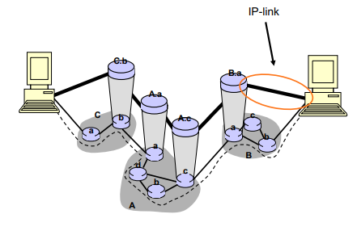
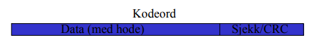
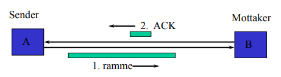
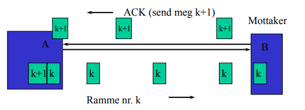
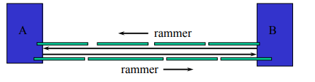
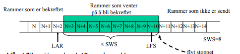
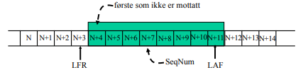
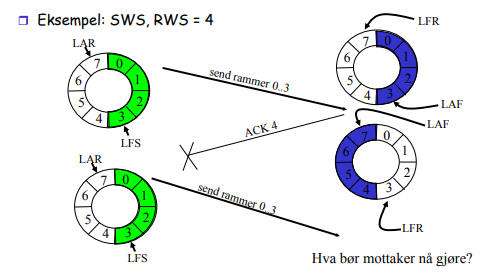
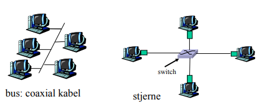
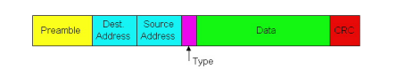

# Link laget

## Internettets overlay arkitektur

Internett rutere ble skapt for å skape internett abstraksjonen.
Stilte minimale krav til IP link protokollen pga fragmentert nettverks oppsett hos forksjellige aktører/nettverk.

**Enkelt å bygge IP linker på toppen av andre nettverks stacks**



## Link typer
- punkt til punkt (enkel kabel)
- broadcast link (delt kabel/trådløs)
- Svitsjet (feks: svitches Ethernet)

## Linklagets tjenester

### Framing og linkaksess
- Pakke data inne i en ramme (frame) og legge til hode og hale.
- Implementere kanalaksess dersom det er delt medium.
- "Fysiske adresser" blir brukt i rammeheaderene til å identifisere kilde og destinasjon når det er delt medium.

### Pålitelig levering
- Sjelden brukt i fiberoptikk, co-axial kabel og noen varianter av twisted pair pga. lav feil rate.
- Brukt på trådløslinker hvor målet er å redusere feil, og unngå ende til ende retransmisjoner.

### Flytkontroll
- Hastighetsavpassing mellom sender og mottaker

### Feildeteksjon
- Feil kommer av støy og signalreduksjon
- Mottaker oppdater feil i motatt ramme.
- Den signalerer for retransmisjon, eller den bare kaster rammen.

### Feilkorreksjon
- Mekanisme hvor mottakeren retter feilen uten å be om retransmisjon

## Feilfinning og feilretting

Oppgaver
1. Finne feil
2. Rette feil - to alternativer til å rette feil:
 - Han nok informasjon til å rette opp de mottatte dataene.
 - Be om data(rammen) blir sendt en gang til
 - (Gi blanke, det er ikke så farlig å miste litt data)

**Generelt prinsipp i informatikken: oppdag feilen så fort som mulig etter den har oppstått**


## Feildeteksjon
Den minimalle mengen ekstra informasjons som må til for å rette n antall bit feil og oppdage n+1 antall bit feil

### Bit feil i rammer
- Behov for mekanismer som oppdager bit-feil

### Teknikker som ofte benyttes i datanett
- Paritet - to-dimensjonal paritet
    - BISYNC ved ASCII overføring
- Sjekksum
    - flere internett-protokoller
- Cyclic Redundency Check (CRC)
    - svært utbredt

## Paritet (tversum)
- Ett paritetsbit:
    - F.eks 7 bit data, sendes som 8 bit.
    - Like paritet dvs. et like antall enere i resultatet.
    - Odde paritet dvs. et odde antall enere i resultatet.
- Like parietet: 0110001 sendes som 01100011.
- Odde parietet: 0110001 sendes som 01100010.
- Mulig med fleres paritets bit.
    - Generelt: Jo mer data til redundanse, jo flere feil oppdages.

## Internetts sjekksum algoritme
Se på en melding som en sekvens av 16-biters heltall.
- Senderen adderer disse heltallene sammen vd bruk av 16-biters aritmetikk.
- Dette 16-biters tallet er sjekksummen.
- Motakker utfører samme beregningen og sammenligner resultatet med den mottatte sjekksum.
- Får mottaker feil resultat er det bitfeil enten i dataene eller i sjekksummen.

**Bentyttes ende til ende i Internett**

## CRC: Cyclic Redundancy Check
Generalisering av paritet
Punkter i et n-dimensjonalt rom



- Like paritet: Kodeordet delt på 2 skal ikke gi rest.
- CRC: Kodeordet delt på et tall G, skal ikke gi rest.

Dette tallet vi deler på kaller vi Generatorpolynomet.
Deling foregår ved modulo-2 regning, dvs ikke mente eller låning.

## Pålitelig overføring

- Rammer med feil CRC kastes
- Fint om vi kan rette opp feilen
- Hvis feilen ikke kan rettes opp, og vi trenger rammen, da må den sendes en gang til
- Også her er det en avveiing: Ende-til-ende eller mellom noder?

### Når omsending av rammer er nødvendig
#### To fundementale mekanismer
- Kvittering (engelsk: acknowledgements, ack)
- Tidsfrister(timeouts)

Note:
- Kvitteringen kan bli borte
- Ønsker vi at rammene skal komme frem i riktig rekkefølge?


## Stop-and-Wait



Mottaker sender ack tilbake når en ramme er mottatt, og først når
sender mottack ack, sendes en ny ramme. På denne måten blir ikke mottaker oversvømmet av rammer, og avsender vet at alle rammer er kommet trygt fram.

Men hva hvis rammer blir borte?

### Grunnleggende algoritme
- send en ramme og vent på kvittering (ACK ramme).
- dersom ACK ikke mottatt innen gitt tidsfrist, send rammen på nytt.

#### Problem 1 med grunnleggende algoritme
- Men kanskje det var ACK som ble borte.
- Vi må kunne sende den samme rammen på nytt, selv om den allerede er kommet riktig frem.

#### Problem 2 med grunnleggende algoritmen
- Kanskje vi sendte rammen omigjen for tidlig
- Vi må godta at ACK kommer for sent

#### Løsning: Sekvensnummer



Det er nok med en en-bits teller (0 og 1) når det bare sendes en pakke for hver ACK. k, k+1 renges da modulo 2. Ja dette går bra!


**svakhet: utnytter linjekapasistet dårlig**
- sender kan bare ha en utestående ramme til enhver tid. Mye bortkastet tid.

## Fyll opp røret
Utnytte linjen bedre.
Sende flere rammer rett etter hverandre:



ACK/NAK *piggybacker* ofte på andre rammer som går andre veien.

## Glidende vindu

**Ide:**
- Tillat senderen å sende flere rammer for den mottar en ACK for å derved holde "røret fult"
- Det må være en øvre grense på antall rammer som kan vøre utestående (som det ikke er mottat ACK for).

Flere bufre hos sender og flere bufre hos mottaker, mange rammer med forskjellige nummer og mange ack/nack med forskjellige nummer underveis hele tiden.

Trenger flere bufre hos sender og mottaker
 - Usikkerhets vindu

-NAK (negativ kvittering)
-Selektiv kvittering
- Både SAK og NAK øker kompleksiteten til implementasjonen


## Glidende vidu: Sender
Tilordner sekvensnummer til hver ramme (SeqNum).
#### Vedlikeholder tre tilstandsvarabler
- send window size (SWS)
- last acknowledgment received (LAR)
- last frame sent (LFS)

**Vedlikeholder invariant: LFS - LAR <= SWS**



Når ACK mottas, økes LAR, og derved kan ny ramme sendes slik at LFS økes. Buffer for opptl SWS rammer, dvs SWS rammer i "røret" samtidig.

## Glidende vindu: mottaker

#### Vedlikeholder tre tilstandsvariabler
- Receive window size (RWS)
- largest acceptable frame (LAF)
- last frame received (LFR) (med alle "mindre" rammer også motatt)

**Vedlikeholder invariant: LAF - LFR <= RWS**


### Kumulativ kvittering ("go back n" protokoll)
dvs, vi ACK-er ikke ne rammer hvos det er hull i sekvenser av mottatte rammer.

```
if LFR < MottatRamme.SeqNum < LAF then
    ta-imot-rammen-og-legg-den-på-pass;
    beregn-nye-grenser(MottatRamme.SeqNum)
else
    kast rammen;
send ACK(LFR + 1)
```

**Invariant: LFR + 1 er første ramme som ikke er mottatt**
#### beregn-nye-grenser(seqNo)

```
if seqNo == LFR + 1 then
    beregn ny LFR og LAF:
        for (i = LFR + 1; ramme i er mottatt; i++){};
        LFR = i-1;
        LAF = LFR + RWS;


```

#### Varianter til "go back n" protokoll
- Negativ kvittering (NAK)
    - Mottaker sender NAK på rammer som savnes
- Selektiv kvittering (SAK)
    - Mottaker sender ACK på nøyaktig de rammer som mottas
    - Disse behøver da ikke re-sendes

**Både SAK og NAK øker kompleksiteten til implementasjonen, men kan potensielt bedre utnyttelse av linjen**

## Glidende vindu: endelige sekvensnummer

- I praksis representeres sekvensnummer med et endelig antall biter.
- n biters sekvensnummer => intervall sekv.nr = (0...2<sup>n</sup>-1)
- I HDLC: n = 3, dvs. sekvensnummerintervall (0..7)
    - => sekvensnummer må gjennbrukes

#### Problem
    Skille mellom ulike inkarnasjoner av samme numre
#### Minimum krav
    sekvensnummerintervallet må være støøre en maks.antall utestående rammer

## Glidende vindu: endelig sekvensnummer
#### SWS <= MaxSeqNum+1 er ikke tilstrekkelig
- anta 3 biters SeqNum felt (0..7)
- SWS=RWS=8
- sender transmitterer rammene 0..6
- mottas uten feil, men ACK går tapt
- senders tidsfrist utløper, rammene 0..6 sendes på nytt
- mottaker forventer 7, 0..5 me mottar andre inkarnasjon av o..5

#### SWS, RWS <= (MaxSeqNum+1)/2 er riktig regel
Hinderer overlapp mellom *nedre kant* av sendervinduet og *øvre kant* av mottakervinduet.



## Oppsummering
Ikke alle linklag medium implementerer feilhåndtering. Spesielt kablede medium overlatter dette mer til *ende-til-ende*. Men trådløs bruker det mer da trådløs har mer feilrate.


## Ethernet
*En familie av teknologier*
Nye teknologier som kom beholdt ethernet navnet.

#### Dominerende teknologi for kablet LAN
- billig
- Første LAN teknologi i vanlig bruk
- I utgangspunk eklere en konkurrentene
- Stadig nue standarder 10 Mbps - 10 Gbps

Tanken med ethernet var opringelig at det var en kabel som alle maskiner var koblet på. Dette medførte at ethernet trengte en form for *media access* protokol.

## Stjerne topology

#### Opprinnelig var Ethernet bus-basert
- alle noder i samme kollisjonsdomene

#### Idag stjerne-topologier
- aktiv switsj i sentrum



## Ethernet rammestruktur
#### Addresse: 6 bytes (MAC addresse)
- Om adaptere mottar ramme med matchende destinasjonsadresse eller med broadcastadresse tas pakken imot.
- I motsatt tilfelle tas dne ikke imot.

#### Type: indikerer høyere lags protocol (ikke mye i bruk, oftest står det IP, men andre er mulige f.eks Novell IPX, AppleTalk)

#### CRC:Sjekkes hos mottaker, om den ikke stemmer kastes rammen



*MAC addressen skal i prinsippet være unik for alle ethernet kort,slik at utstyr kan fungere "out-of-the-box". Det fins en sentral autoritet som deler ut MAC adress ranges.*

## Ethernet: upålitelig, forbindelseløs

#### Forbindelsesløs
Ingen handshake mellom sender og mottaker før sending.


#### Upålitelig
Mottagende NIC sender ingen bekreftelse til sendene NIC
- Strømmen av rammer som levers videre opp til nettlaget kan inneholde "hull" (manglende rammer).
- Hullene kan fulles igejn av nettlaget (TCP)
- I motsatt fall vil hullet bli synlig for applikasjonen

## Ethernet CSMA/CD algoritme

1. NIC receives datagram from
network layer, creates frame

2. If NIC senses channel idle,
starts frame transmission If
NIC senses channel busy,
waits until channel idle, then
transmits

3. If NIC transmits entire frame
without detecting another
transmission, NIC is done with
frame !

4. If NIC detects another
transmission while
transmitting, aborts and
sends jam signal

5. After aborting, NIC enters
**exponential backoff**: 
    after m*th* collision, NIC chooses K at random from {0,1,2,…,2m-1}. NIC waits K·512 bit times, returns to Step 2

*I dag ikke så nødvendig da pga svitsjing er det som oftest bare to på en ethernet link.*

## 802.3 Ethernet Standarder: Link & Fysiske Lag

#### Mange forskjellige Ethernet standarder
- Felles rammeformat
- Forksjellige hastigher: 2 Mbps, 100 Mbps, 1Gbps ,10Gbps
- Forksjellige fysiske lag: fiber, cabel

## Ethernet switch
- Kommer ikke til å være endel av pesum pga at det ikke ble tid i forelesningen