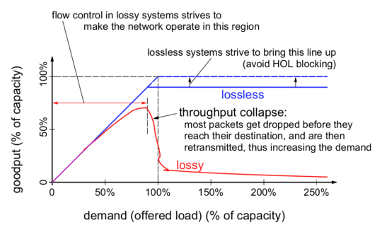
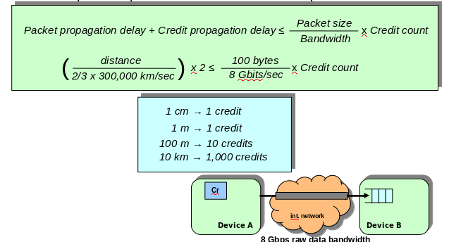
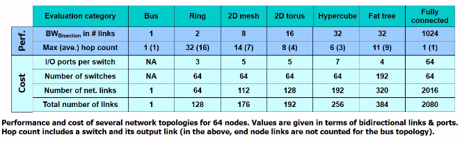

# Interconnection Networks


## Resons to devote attention to interconnection networks - "interconnects"
- They provide connectivity within a single computer system at many levels, and between aggregated computers to offer High Performance Computing (HCP)
    - I/O units, boards, chips, modules and blocks inside chips
- Trends: high demand on communication bandwidth
- Application Trends: Big Data, AI, IoT
    - Increased computing power ad storage capacity
    - Switched networks and replacing buses
- Computer architects must understand interconnect problems and solutions in order to more effectively design and evaluate systems

#### Goal
To provide an overview of designing interconnection networks and potential solutions.


## Interconnection Network Domains

Interconnection networks can be grouped into two major networking domains, depending on the number and proximity of devices to be interconnected: OCNs and SANs

### Domains

Two types:
- On-chip network (OCN)
- System/storage area network (SAN)
    Different standards and proprietary solutions 

#### On-chip networks (OCNs), a.k.a., network-on-chip (NoC)
- Interconnect microarchitecture functional units, register files, caches, compute tiles, processor and IP cores
- Chip or multichip modules
- Tens (in future, possibly 100s) of devices interconnected
- Maximum interconnect distance on the order of centimeters
- Examples (custom designed)
    Element Interconnect Bus (Cell Broadband Engine processor chip) 2,400 Gbps (3.2 Ghz processor clock), 12 elements on the chip

#### System/storage area networks (SANs)
*Also referred to as "off-chip"*

- Multiprocessor and multicomputer systems
    - Is about aggregating computing power in a way that can deliver extreme computing (HPC)
    - Interprocessor and processor-memory interconnections
- Server and data center environments
    - Storage and I/O components
- Hundreds to thousands of devices interconnected 
    - Summit - IBM supercomputer at Oak Ridge National Laboratory- the world´s most powerful computer right now (4,608 nodes and 27,648 GPUs, 2,414,592 cores in total)
- Maximum interconnect distance typically on the order of tens of meters, but some with as high as a few hundred meters
    - InfiniBand: 120 Gbps over a distance of 300 m
- Examples (standards and proprietary)
    - InfiniBand, OmniPath, Data Center Ethernet, Scalable Coherent Interface (SCI)


## Interconnecting two devices

#### An Ideal Network
- Two end node devices (A and B).
- Device A (or B) may read an address in device B (or A).
- Interconnection networks behaves as *dedicated links* between A, B.
    - Unidirectional wires each way dedicated to each device
- Receiving buffers used for staging the transfers at the end nodes.
- Communication protocol: request, reply
    - Basic functions at end nodes to commence and complete communication.


## Network interface functions
- A message is the unit of information: header, payload, trailer

#### Interfacing to the network (hardware)
- Communication device itself (OCNs and some SANs)
- Additional network interface card or NIC (SANs, LANs, WANs)
    - Embedded processor(s), DMA engine(s), RAM memory

## Basic Network Structure and Functions

#### Reliable delivery of packets: lossy versus lossless networks
- Must prevent the sender from sending packets at a faster rate that can be received and processed by the receiver.
- Lossy networks
    - Packets are dropped (discarded) at receiver when buffers fill up.
    - Sender is notified to retransmit packets (via time-out or NACK).
- Lossless networks (flow controlled)
    - Before buffers fill up, sender is notfied to stop packet injection.
        - Xon/Xof (Stop & Go) flow control
        - Credit-based flow control (token or batched modes)
- Implications of network type (lossless vs lossy)
    - Constrains the solutions for packet routing, congestion, & deadlock.
    - Affects network performance
    - The network domain dictates which is used
        - OCN, SAN: Typically lossless
        - LAN, WAN: Typically lossy


### Goodput versus Demand in Lossy and Lossless Flow Controll




## Xon/Xoff flow control
Todo - fill out
## Credit-based flow control
Todo - fill out

## Comparison of Xon/Xoff vs credit-based flow controll


## Example: comparison of flow control techniques
- Calculate the minimum amount of credits and buffer space for interconnect distances of 1 com, 1 m, 100m , and 10 km.
- Assume a dedicated-link network
    - 8 Gbps (raw) data bandwidth per lin (each direction)
    - Credit-based flow control
- Device A continuously send 100-byte packets (header included).
- Consider only the link propagation delay (no other delays or overheads).

```
Packet propagation delay + Credit propagation delay <= (Packet size/Bandwith) * Credit Count
```



## Interconnection Many Devices

## Additional Network Structure and Functions

#### Network topology - being a regular structure
- *What paths are possible for packets?*
- Networks usually share paths among different pairs of devices.

#### Routing
- *Which of the possible paths are allowable (valid) for packets?*
- Provides the set of operations needed to compute a valid path.
- Executed at source, or at each intermediate node.

#### Arbitration
- *When are paths available for packets?* (along with flow control)
- Resolves packets  requesting the same resources at the same time.
- For every arbitration, there is a winner and possibly many losers
    - Losers are buffered (lossless) or dropped on overflow (lossy).

#### Switching
- *How are paths allocated packets?*
- The winning packet (from arbitration) proceeds towards destination.
- Paths can be established one fragment at a time or in their entirety.

**Complexity and applied order depends on the category of the topology: *shared-media* or *switched media***

## Switched-based Networks
- Disjoint portions of the media are shared via switching.
- Switch fabric components
    - Passive point-to-point links
    - Active switches
        - Dynamically establish communication between sets of source-destination pairs
- Aggregate bandwidth can be many times higher than that of shared-media networks.


## Comparison of Shared-media versus Switched-based Networks

#### Shared media networks
- Low cost.
- Aggregate network bandwidth does not scale with # number of devices.
- Global arbitration scheme required (a possible bottleneck).
- Time of flight increases with the number of end nodes.

#### Switched-based networks
- Aggregate network bandwidth scales with number of devices
- Concurrent communication
    - Potentially much higher network effective bandwidth
- Beware: inefficient designs are quite possible
    - Superlinear network cost but sublinear network effective bandwidth

## Characterizing Performance: Latency & Effective Bandwidth


## Network Topology

## Preliminaries and Evolution

#### One switch suffices to connect a small number of devices
- Number of switch ports limited by VLSI technology, power consumption, packaging, and other such cost constraints.

#### A *fabric* of interconnected switches (i.e witch fabric or network fabric) is needed when the number of devices is much larger
- The topology must make a path(s) available for every pair of devices - property of connectedness or full access (What paths?)

#### Topology defines the connection structure across all components
- Bisection bandwidth: the minimum bandwidth of all links crossing a network split into two roughly equal halves.
- Full bisection bandwidth:
    - Network BW<sub>Bisection</sub> = Injection (or Reception) BW<sub>Bisection</sub> = N/2
- Bisection bandwidth mainly affects performance
#### Topology is constrained primarily by local chip/board pin-outs and not least the routing function.

## Bisection Bandwidth


## Centralized Switched Networks
#### Crossbar network
- Crosspoint swtich complexity increases quadratically with the number of crossbar input/output ports, N, i.e grows as O(N<sup>2</sup>)
- Has the property of being non-blocking


## Indirect Networks
#### Multistage interconnection networks (MINs)
- Crossbar split into several stages consisting of smaller crossbars => k x k switches
- Complexity grows as O(N x log N), where N is # of end nodes, with log<sub>k</sub>N switch stages, each with N/k switches, and the total number of switches is N/k(log<sub>k</sub>N)
- Inter-stage connections represented by a set of permutation functions


#### Reduction in MIN switch cost comes at the price of performance
- Network has the property of being blocking
- Contention is more likely to occur on network links
    - Paths fom different sources to different destinations share one or more links


#### How to reduce blocking MINs Provide alternative paths!

- Use larger switches (can equate to using more switches)
    - **Clos network:** minimally three stages (non-blocking)
        - A larger switch in the middle of two other switch stages provides enough alternative paths to avoid all conflicts
- Use more switches 
    - Add log<sub>k</sub>N - 1 stages, mirroring the original topology
        - **Rearrangeably non-blocking**
        - Allows for non-conflicting paths
        - Doubles network hop count (distance), d
        - Centralized control can rearrange established paths
    - **Benes topology:** 2(log2N) - 1 stages (rearrangeably non-blocking)
        - Recursively applies the three-stage Clos network concept to the middle-stage set of switches to reduce all switches to 2 x 2


#### Bidirectional MINs
*Most used topology in data centers*

- Increase  modularity
- Reduce hop count, d
- Fat tree network
    - Nodes as tree leaves
    - Switches as tree vertices
    - Total link bandwidth is constant across all tree levels,with full bisection bandwidth
    - Equivalent to folded Benes topology
    - Preferred topology in many SANs


## Distributed Switched - Direct Networks
- Tight integration of end node devices with network resources
    - End nodes distributed among network switches
    - A “node” now consists of a network switch with one or more end node devices directly connected to it
    - Nodes are directly connected to other nodes
- **Fully-connected network:** all nodes are directly connected to all other nodes using bidirectional dedicated links


## Direct Networks

#### Example: Compute the switch and link costs of interconnecting   N nodes using a fully connected topology relative to a crossbar, assuming
    - Cost of a k x k switch grows quadraticaly with the number of unidirectional ports
    - Cost of a 1 x k switch grows only linearly


- As N increases, the switch cost nearly doubles the crossbar’s
- Link cost is always higher than a crossbar’s
- No extra benefits of a fully connected network over a crossbar!


## Comparison of Indirect and Direct Networks
Bristling can be used to reduce direct network switch & link costs
- “b” end nodes connect to each switch, where b is bristling factor
- Allows larger systems to be built from fewer switches and links
- Requires larger switch degree
- For N = 64 and k = 8, fewer switches and links than fat tree


## Comparison of Indirect and Direct Networks
Blocking reduced by maximizing dimensions (switch degree)
- Can increase bisection bandwidth, but
    - Additional dimensions may increase wire length (must observe 3D packaging constraints)
    - Flow control issues (buffer size increases with link length)
    - Pin-out constraints (limit the number of dimensions achievable)



## Routing
- Performed at each switch, regardless of topology.
- Defines the “allowed” path(s) for each packet (Which paths?).
- Need to __direct packets through network__ to intended destinations.
#### Ideally:
- Supply as many routing options to packets as there are paths provided by the topology, and evenly distribute network traffic among network links using those paths, minimizing contention
- Problems: situations that cause packets to never reach their dest.
    - Livelock
        - Arises from an unbounded number of allowed non-minimal hops
        - Solution: restrict the number of non-minimal (mis)hops allowed
    - Deadlock
        - Arises from a set of packets being blocked waiting only for network resources (i.e., links, buffers) held by other packets in the set
        - Probability increases with increased traffic & decreased availability

### Common forms of deadlock
*Routing-induced deadlock* 


### Common strategies to deal with all forms of deadlock
- **Deadlock avoidance:** restrict allowed paths only to those that  keep the global state deadlock-free, i.e. the channel dependency graph cycle free
    - **DOR** (dimension-order routing) on meshes and hypercubes
        -Establish ordering on all resources based on network dimension
    - DOR on rings and tori (k-ary n-cubes with wrap-around links)
        - Ordering on all resources between and within each dimension
        - Apply to multiple virtual channels (VCs) per physical channel
    - Alternatively, keep resources along each dimension from reaching full capacity by ensuring the existence of a bubble(s)


### Common strategies to deal with all forms of deadlock
#### Deadlock recovery:
allow deadlock to occur, but once a potential deadlock situation is detected, break at least one of the cyclic dependencies to gracefully recover
    - A mechanism to detect potential deadlock is needed
    - Regressive recovery (abort-and-retry): remove packet(s) from a dependency cycle by killing (aborting) and later re-injecting (retry) the packet(s) into the network after some delay
    - Progressive recovery (preemptive): remove packet(s) from a dependency cycle by rerouting the packet(s) onto a deadlock-free lane
#### Deterministic routing:
routing function always supplies the same path for a given source-destination pair (e.g., DOR)

#### Adaptive routing:
routing function allows alternative paths for a given source-destination pair
    - Increases routing freedom to improve network efficiency, 


## Concluding Remarks

#### Interconnection network design is an exciting area of computer architecture
- on-chip networks between cores on within a chip
- off-chip networks between chips and boards within a system

#### Interconnection networks should be designed to transfer the maximum amount of information within the least amount of time (and cost, power constraints) so as not to bottleneck the system

#### The design of interconnection networks is end-to-end
- injection links/interface, network fabric, reception links/interface
- topology, routing, arbitration, switching, and flow control are among key concepts in realizing high-performance designs
- a simple, general throughput model can be used to guide design

#### Improving the performance of interconnection networks is critical to advancing our information- and  communication-centric world

## Characterizing Performance: Latency & Effective Bandwidth
#### Terms and Definitions:
- Bandwidth:
    - Maximum rate at which information can be transferred (including packet header, payload and trailer)
    - Unit: bits per second (bps) or bytes per second (Bps)
    - Aggregate bandwidth: Total data bandwidth supplied by network
    - Effective bandwidth (throughput): fraction of aggregate bandwidth that gets delivered to the application
- Time of flight: Time for first bit of a packet to arrive at the receiver
    - Includes the time for a packet to pass through the network, not including the transmission time (defined next) 
    - Picoseconds (OCNs), nanoseconds (SANs), microseconds (LANs), milliseconds (WANs)

- Transmission time: 
    - The time for a packet to pass through the network, not including the time of flight
    - Equal to the packet size divided by the data bandwidth of the link
- Transport latency:
    - Sum of the time of flight and the transmission time
    - Measures the time that a packet spends in the network
- Sending overhead (latency):
    - Time to prepare a packet for injection, including hardware/software
    - A constant term (packet size) plus a variable term (buffer copies)
-   Receiving overhead (latency):
    - Time to process an incoming packet at the end node
    - A constant term plus a variable term
    - Includes cost of interrupt, packet reorder and message reassembly

