# MPLS

## Theory 

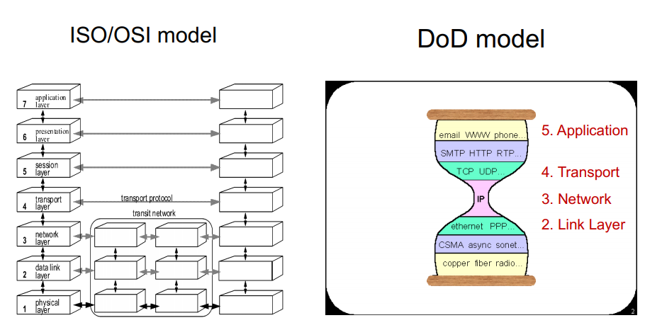

## Reality

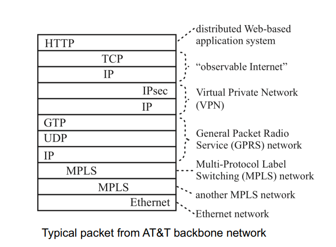

## Introduction
### The business drivers for MPLS

### The Big Picture

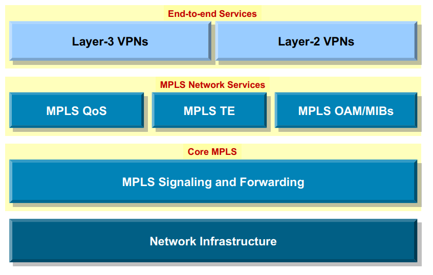

### Why Multi Protocol Label Switching?
- SP/Carrier perspective
    - Reduce costs (CAPEX); consolidate networks
    - Consolidated network for multiple Layer-2/3 services
    - Support increasingly stringent SLAs
    - Handle increasing scale/complexity of IP-based services
- Enterprise/end-user perspective
    - Campus/LAN
        Need for network segmentation (users, applications, etc.)
    - WAN connectivity (connecting enterprise networks)
        Need for easier configuration of site-to-site WAN connectivity

### What Is MPLS Technology?
- It’s all about labels …
- Use the best of both worlds
    - Layer-2 (ATM/FR): efficient forwarding and traffic engineering
    - Layer-3 (IP): flexible and scalable
- MPLS forwarding plane
    - Use of labels for forwarding Layer-2/3 data traffic
    - Labeled packets are being switched instead of routed
        - Leverage layer-2 forwarding efficiency
- MPLS control/signaling plane
    - Use of existing IP control protocols extensions + new protocols to exchange label information
        - Leverage layer-3 control protocol flexibility and scalability

### Evolution of MPLS
- Evolved from tag switching in 1996 to full IETF
standard, covering over 130 RFCs
- Key application initially were Layer-3 VPNs, followed
by Traffic Engineering (TE), and Layer-2 VPNs

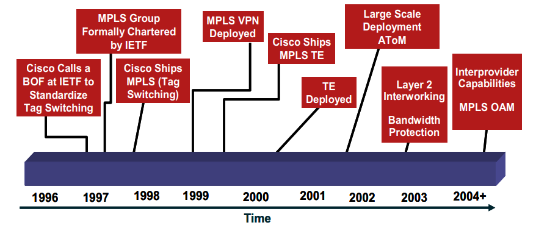

### MPLS Applications

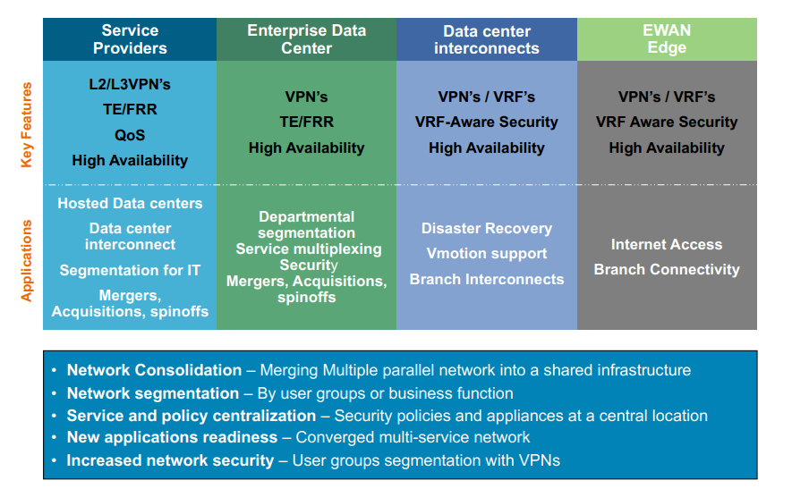

### Enterprise MPLS Customers
- Two types of enterprise customers for MPLS
technology
- MPLS indirectly used as subscribed WAN service
    - Enterprise subscribes to WAN connectivity data service offered by external Service Provider
    - Data connectivity service implemented by Service Provider via MPLS VPN technology (e.g., layer-2 and layer-3 VPNs)
    - VPN Service can be managed or unmanaged
- MPLS used as part of self managed network
    - Enterprise deploys MPLS in it’s own network
    - Enterprise manages it’s own MPLS-based network

## MPLS Technology Components
### Basic building blocks of MPLS

### MPLS Forwarding and Signaling
- MPLS label forwarding and signaling mechanisms 

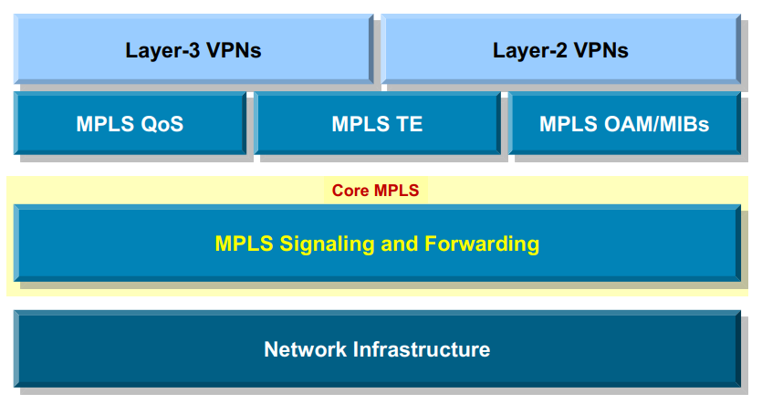

### Basic Building Blocks
- The big picture
    - MPLS-enabled network devices
    - Label Switched Paths (LSPs)
- The internals
    - MPLS labels
    - Processing of MPLS labels
    - Exchange of label mapping information
    - Forwarding of labeled packets
- Other related protocols and protocols to exchange label information
    - Between MPLS-enabled devices

## MPLS Network Overview

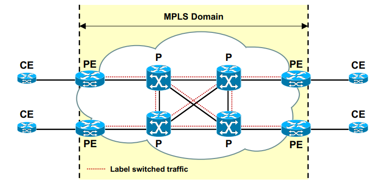

-  P (Provider) router = label switching router = core router (LSR)
    - Switches MPLS-labeled packets
-  PE (Provider Edge) router = edge router (LSR)
    - Imposes and removes MPLS labels
- CE (Customer Edge) router
    - Connects customer network to MPLS network

## MPLS Label and Label Encapsulation

### MPLS Label
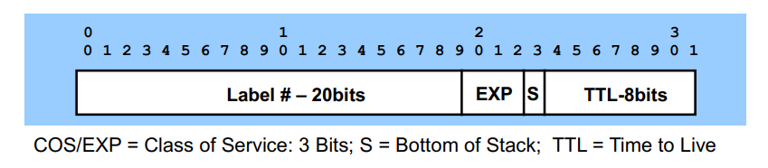

### MPLS Label Encapsulation

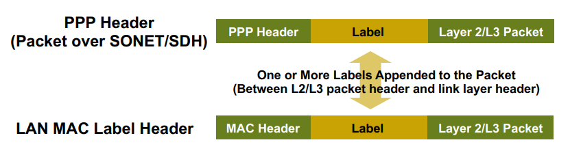

### MPLS Label Operations

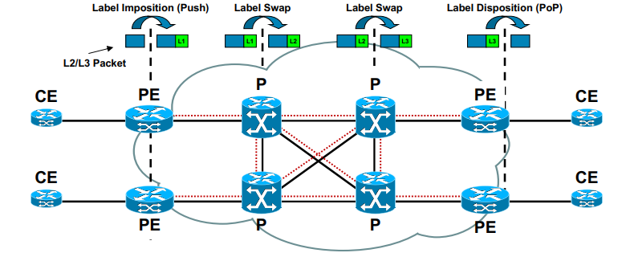

- Label imposition (Push)
    - By ingress PE router; classify and label packets
- Label swapping or switching
    - By P router; forward packets using labels; indicates service class & destination
- Label disposition (PoP)
    - By egress PE router; remove label and forward original packet to destination CE

### Forwarding Equivalence Class

- Mechanism to map ingress layer-2/3 packets onto a Label Switched Path (LSP) by ingress PE router
    - Part of label imposition (Push) operation
- Variety of FEC mappings possible
    - IP prefix/host address
    - Groups of addresses/sites (VPN x)
        - Used for L3VPNs
    - Layer 2 circuit ID (ATM, FR, PPP, HDLC, Ethernet)
        - Used for Pseudowires (L2VPNs)
    - Tunnel interface
        - Used for MPLS traffic engineering (TE)

### Label Distribution Protocol
- MPLS nodes need to exchange label information with each other
    - Ingress PE node (Push operation)
        - Needs to know what label to use for a given FEC to send packet to neighbor
    - Core P node (Swap operation)
        - Needs to know what label to use for swap operation for incoming labeled packets
    - Egress PE node (Pop operation)
        - Needs to tell upstream neighbor what label to use for specific FEC type LDP used for exchange of label (mapping) information
    - Label Distribution Protocol (LDP)
        - Defined in RFC 3035 and RFC3036; updated by RFC5036 LDP is a superset of the Cisco-specific Tag Distribution Protocol
- Note that, in addition LDP, also other protocols are being used for label information exchange
    - Will be discussed later

### LDP Operations

- LDP startup
    - Local labels assigned to RIB prefixes and stored in LIB
    - Peer discovery and session setup
    - Exchange of MPLS label bindings
- Programming of MPLS forwarding
    - Based on LIB info
    - CEF/MFI updates

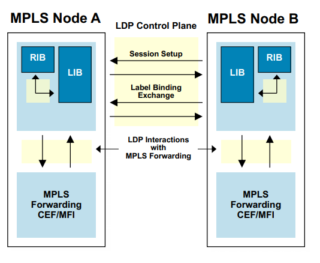

### MPLS Control and Forwarding Plane
- MPLS control plane
    - Used for distributing labels and building label-switched paths (LSPs)
    - Typically supported by LDP; also supported via RSVP and BGP
    - Labels define destination and service
- MPLS forwarding plane
    - Used for label imposition, swapping, and disposition
    - Independent of type of control plane
    - Labels separate forwarding from IP address-based routing
    - MFI – MPLS Forwarding Infrastructure

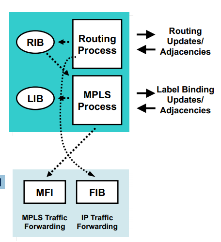

### IP Packet Forwarding Example

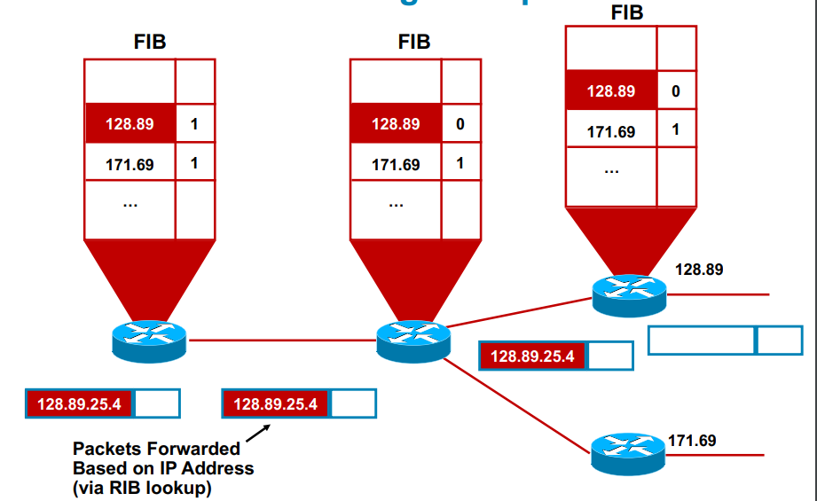

### Step 1: IP Routing (IGP) Convergence

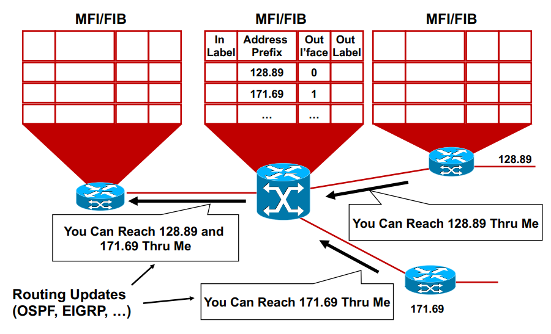

### Step 2a: LDP Assigns Local Labels 

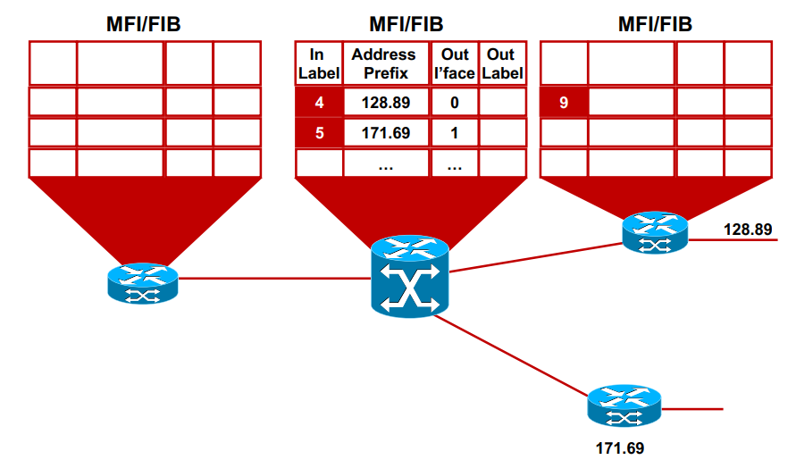

### Step 2b: LDP Assigns Remote Labels

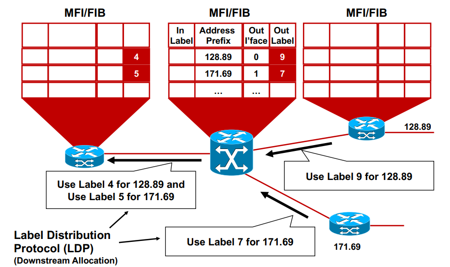

### Step 3: Forwarding MPLS Packets

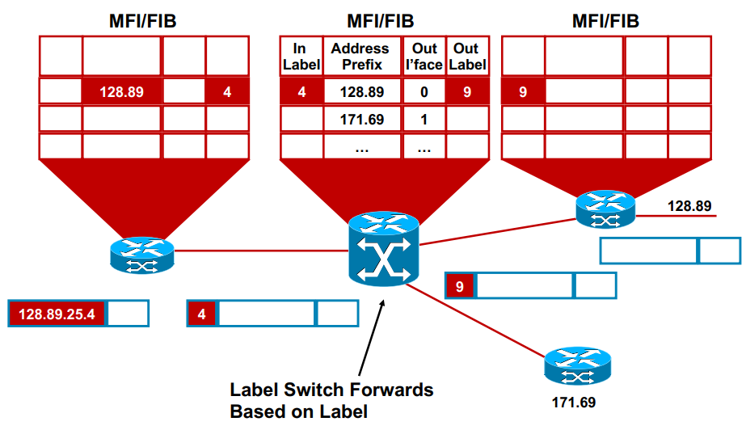

### Summary Steps For MPLS Forwarding
- Each node maintains IP routing information via IGP (Interior Gateway Protocol)
    - IP routing table (RIB) and IP forwarding table (FIB)
- LDP leverages IGP routing information
- LDP label mapping exchange (between MPLS nodes) takes place after IGP has converged
    - LDP depends on IGP convergence
    - Label binding information stored in LIB
- Once LDP has received remote label binding information MPLS forwarding is updated
    - Label bindings are received from remote LDP peers
    - MPLS forwarding via MFI (MPLS Forwarding Infrastructure)

### MPLS Network Protocols

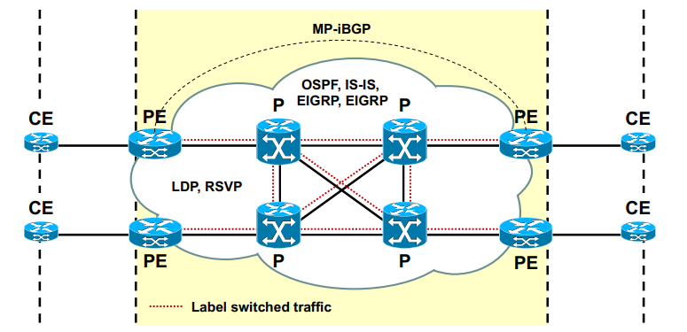

- IGP: OSPF, EIGRP, IS-IS on core facing and core links
- RSVP and/or LDP on core and/or core facing links
- MP-iBGP on PE devices (for MPLS services), MP-BGP:
    - Multiprotocol Border Gateway Protocol, used for MPLS L3 VPN

### Label Stacking

- More than one label can be used for MPLS packet encapsulation
    - Creation of a label stack
- Recap: labels correspond to Forwarding Equivalence Class (FEC)
    - Each label in stack used for different purposes
- Outer label always used for switching MPLS packets in network
- Remaining inner labels used to specific services/FECs, etc.
- Last label in stack marked with EOS bit
- Allows building services such as
    - MPLS VPNs; LDP + VPN label
    - Traffic engineering (FRR): LDP + TE label
    - VPNs over TE core: LDP + TE + VPN label
    - Any transport over MPLS: LDP + PW label

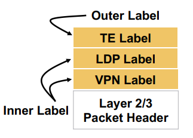

### Summary
- MPLS uses labels to forward traffic
- More than one label can be used for traffic encapsulation; multiple labels make up a label stack
- Traffic is encapsulated with label(s) at ingress and at egress labels are removed in MPLS network
- MPLS network consists of PE router at ingress/egress and P routers in the core
- MPLS control plane used for signaling label mapping information to set up end-to-end Label Switched Paths
- MPLS forwarding plane used for label imposition
(PUSH), swapping, and disposition (POP) operation

## MPLS Traffic Engineering
Technology Overview and Applications

### MPLS Technology Framework
- Traffic engineering capabilities for bandwidth
management and network failure protection

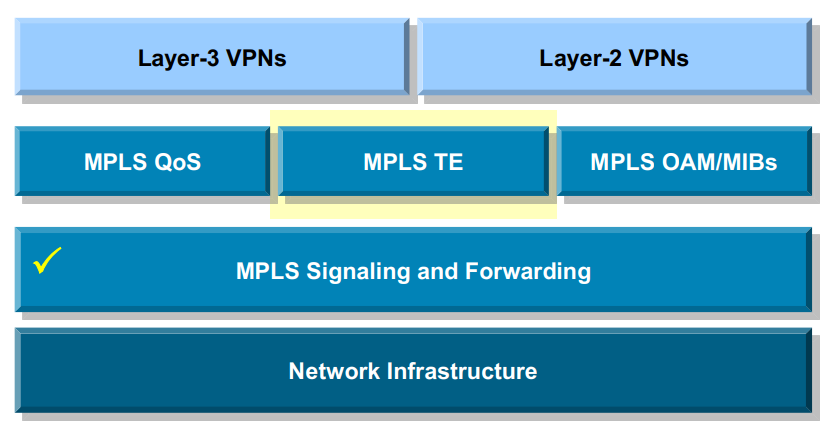

### Why Traffic Engineering?

- Congestion in the network due to changing traffic patterns
    - Election news, online trading, major sports events
- Better utilization of available bandwidth
    - Route on the non-shortest path
- Route around failed links/nodes
    - Fast rerouting around failures, transparently to users
    - Like SONET APS (Automatic Protection Switching)
- Build new services—virtual leased line services
    - VoIP toll-bypass applications, point-to-point bandwidth guarantees
- Capacity planning
    - TE improves aggregate availability of the network

### The Problem with Shortest-Path

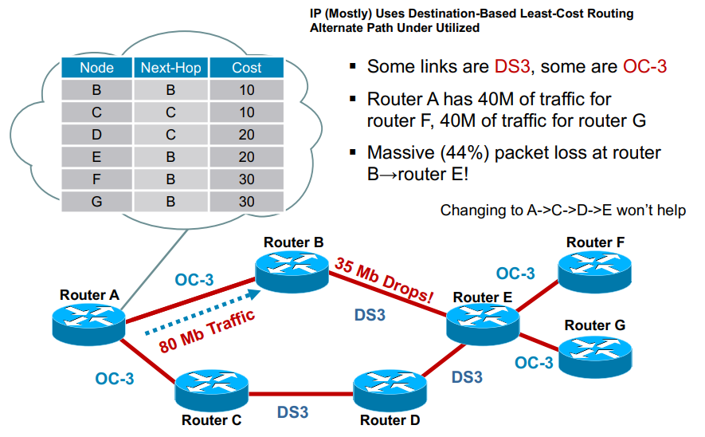

### How MPLS TE Solves the Problem

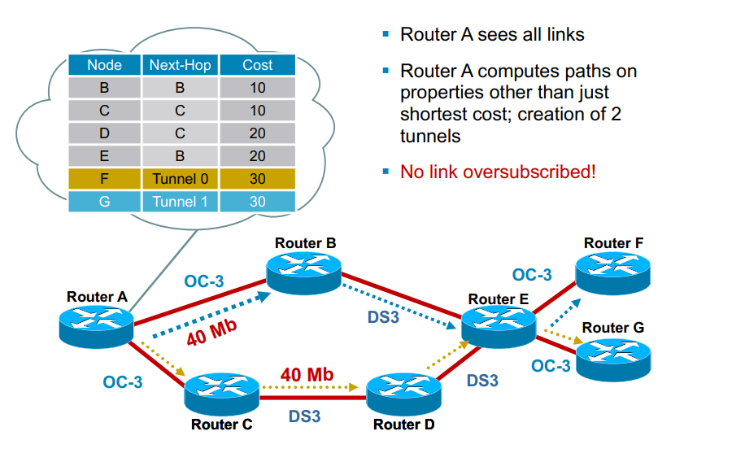

### How MPLS TE Works

- Link information Distribution*
    - ISIS-TE
    - OSPF-TE
- Path Calculation (CSPF)*
- Path Setup (RSVP-TE)
- Forwarding Traffic down Tunnel
    - Auto-route
    - Static
    - PBR
    - CBTS / PBTS
    - Forwarding Adjacency Tunnel select

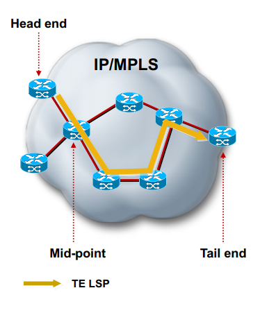

### Path Calculation

- TE nodes can perform constraint-based routing
- Constraints and topology database as input to path computation
- Shortest-path-first algorithm ignores links not meeting constraints
- Tunnel can be signaled once a path is found
- Not required if using offline path computation

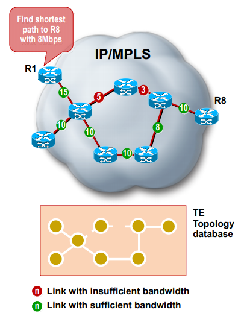

### MPLS TE FRR - Link Protection
*Komme seg rundt et feilsted*

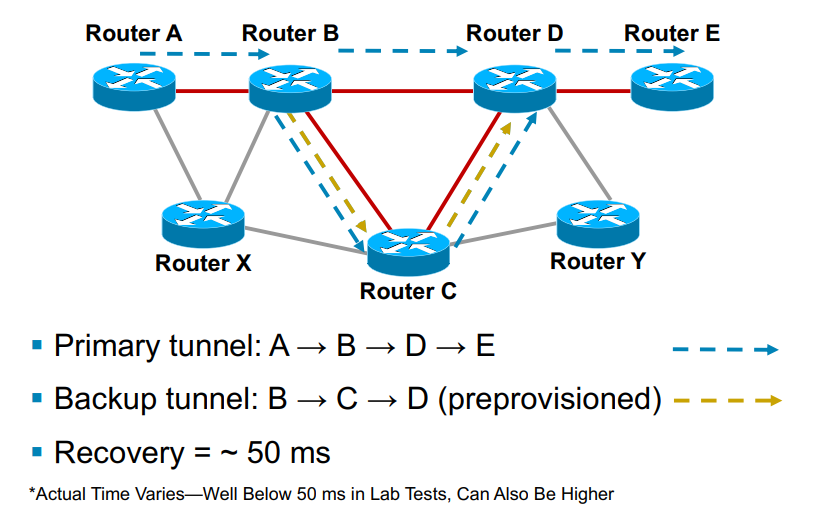

### Use Case 1: Tactical TE Deployment

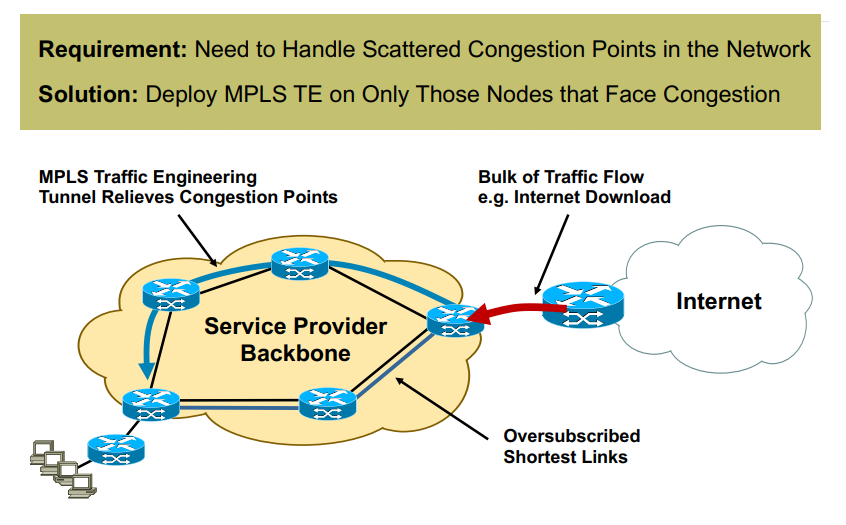

### Use Case 2: 1-Hop Tunnel Deployment

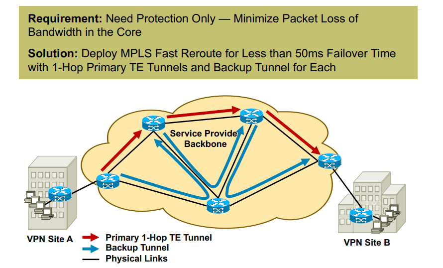

### MPLS TE Summary
- MPLS TE can be used to implement traffic engineering to enable
enhanced network availability, utilization, and performance
- Enhanced network availability can be implemented via MPLS TE Fast Re-Route (FRR)
    - Link, node, and path protection
    - Automatically route around failed links/nodes; like SONET APS
- Better network bandwidth utilization can be implemented via creation of MPLS TE tunnels using explicit routes
    - Route on the non-shortest path
- MPLS TE can be used for capacity planning by creation of
bandwidth-specific tunnels with explicit paths through the network      - Bandwidth management across links and end-to-end paths

## MPLS VPNs
Overviews

### MPLS Technology Framework

- End-to-end data connectivity services across MPLS
networks (from PE to PE)

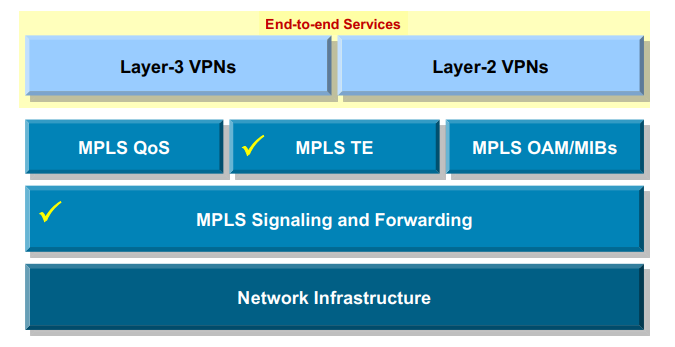

### What Is a Virtual Private Network?
- VPN is a set of sites or groups which are allowed to
communicate with each other in a secure way
Typically over a shared public or private network infrastructure
- VPN is defined by a set of administrative policies
    - Policies established by VPN customers themselves (DIY)
    - Policies implemented by VPN service provider (managed/unmanaged)
- Different inter-site connectivity schemes possible
    - Ranging from complete to partial mesh, hub-and-spoke
- Sites may be either within the same or in different organizations
    - VPN can be either intranet or extranet
- Site may be in more than one VPN
    - VPNs may overlap
- Not all sites have to be connected to the same service provider
    - VPN can span multiple providers

### MPLS VPN Example

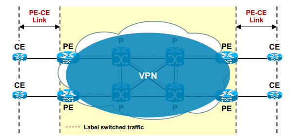

- PE-CE link
    - Connect customer network to SP network; layer-2 or layer-3
- VPN
    - Dedicated secure connectivity over shared infrastructure

### MPLS VPN Benefits

- SP/Carrier perspective
    - Reduce costs (CAPEX)
        - Leverage same network for multiple services and customers
        - Migrate legacy networks onto single converged network
    - Reduce costs (OPEX)
        - Easier service enablement; only edge node configuration
- Enterprise/end-user perspective
    - Enables site/campus network segmentation
        - Allows for dedicated connectivity for users, applications,etc.
    - Enables easier setup of WAN connectivity
        - Easier configuration of site-to-site WAN connectivity (for L3VPN); only one WAN connection needed 

### MPLS VPN Option

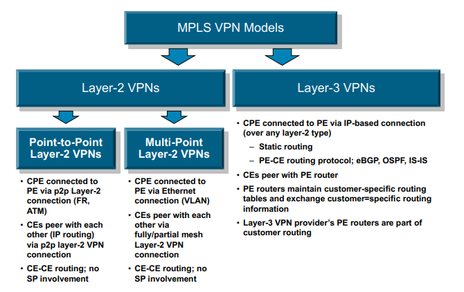

## MPLS Layer-3 VPNs
Technology Overview and Applications

### MPLS L3 VPN Technology Components
- PE-CE link
    - Can be any type of layer-2 connection (e.g., FR, Ethernet)
    - CE configured to route IP traffic to/from adjacent PE Variety of routing options; static routes, eBGP, OSPF, IS-IS
- MPLS L3VPN Control Plane
    - Separation of customer routing via virtual VPN routing table - In PE router: customer I/Fs connected to virtual routing table
    - Between PE routers: customer routes exchanged via BGP
- MPLS L3VPN Forwarding Plane
    - Separation of customer VPN traffic via additional VPN label
    - VPN label used by receiving PE to identify VPN routing table

### Virtual Routing and Forwarding Instance

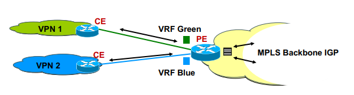

- Virtual Routing and Forwarding Instance (VRF)
- Typically one VRF created for each customer VPN on PE router
- VRF associated with one or more customer interfaces
- VRF has its own instance of routing table (RIB) and forwarding
table (CEF)
- VRF has its own instance for PE-CE configured routing protocols 

### VPN Route Distribution

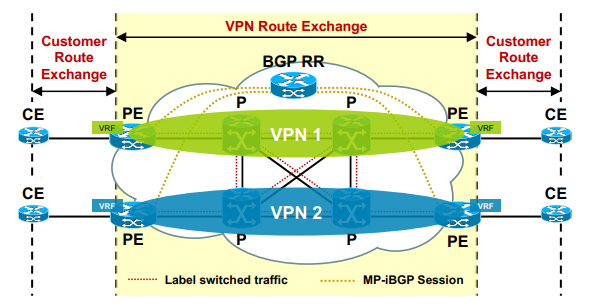

- Full mesh of BGP sessions among all PE routers
    - Multi-Protocol BGP extensions (MP-iBGP)
    - Typically BGP Route Reflector (RR) used for improved scalability

### VPN Control Plane Processing

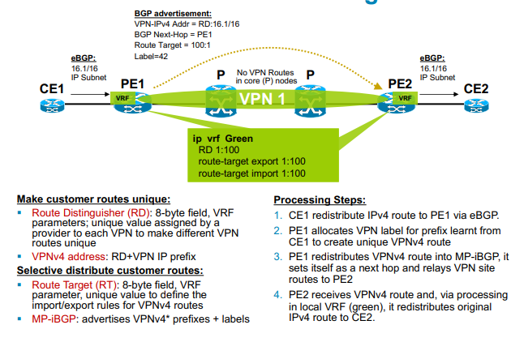

### VPN Forward Plane Processing

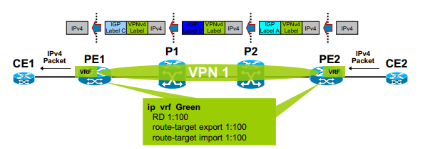

#### Processing Steps:
1. CE2 forwards IPv4 packet to PE2.
2. PE2 imposes pre-allocated VPN label (learned via MP-IBGP) to IPv4 packet
received from CE2.
3. PE2 imposes outer IGP label (learned via LDP) and forwards labeled packet
to next-hop P-router P2.
4. P-routers P1 and P2 swap outer IGP label and forward label packet to PE1.
5. Router PE1 strips VPN label and forwards IPv4 packet to CE1.

### Use Case 1: Traffic Seperation

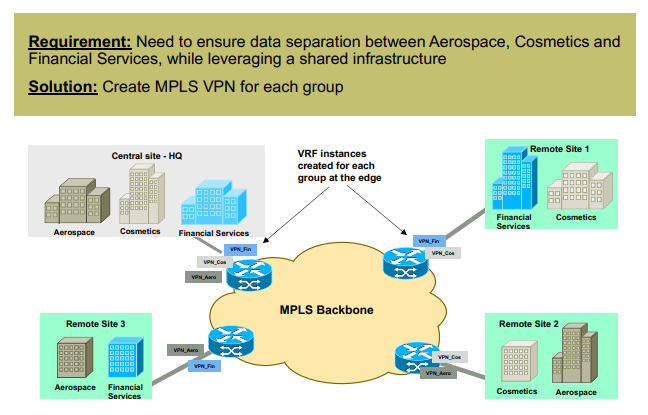

### Use Case 2: Simplify Hub Site Design

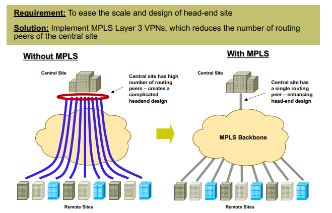

## MPLS Layer-2 VPNs
Technology Overview and Applications

### L2VPN Options

### Layer-2 VPN Overview

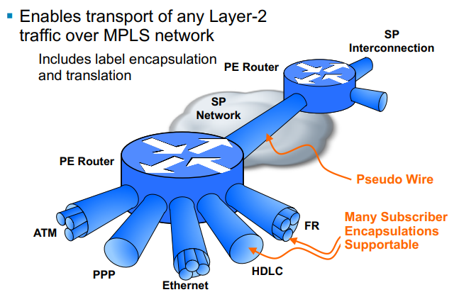

### Any Transport over MPLS Architecture
- Based on IETF’s Pseudo-Wire (PW) Reference Model
- PW is a connection (tunnel) between 2 PE Devices, which
connects 2 PW End-Services
    - PW connects 2 Attachment Circuits (ACs)
    - Bi-directional (for p2p connections)
    - Use of PW/VC label for encapsulation

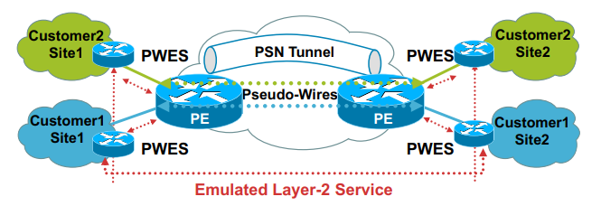

### AToM Technology Components
- PE-CE link
    - Referred to as Attachment Circuit (AC)
    - Can be any type of layer-2 connection (e.g., FR, Ethernet)
- AToM Control Plane
    - Targeted LDP (Label Distribution Protocol) Session
        - Virtual Connection (VC)-label negotiation, withdrawal, error notification
- AToM Forwarding Plane
    - 2 labels used for encapsulation + control word
    - Outer tunnel (LDP) label
        - To get from ingress to egress PE using MPLS LSP
    - Inner de-multiplexer (VC) label
        - To identify L2 circuit (packet) encapsulated within tunnel label
    - Control word
        - Replaces layer-2 header at ingress; used to rebuild layer-2 header at egress

### AToM Control Plane Processing

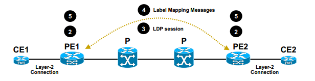

#### Processing Steps (for both P1 and P2):
1. CE1 and CE2 are connected to PE routers via layer-2 connections
2. Via CLI, a new virtual circuit cross-connect is configured, connecting
customer interface to manually provided VC ID with target remote PE
3. New targeted LDP session between PE routers established, in case one
does not already exist
4. PE binds VC label with customer layer-2 interface and sends labelmapping message to remote PE over LDP session
5. Remote PE receives LDP label binding message and matches VC ID with local configured cross-connect

### AToM Forwarding Plane Processing

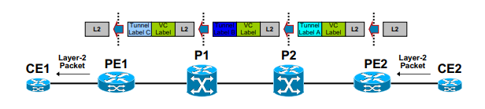

Processing Steps:
1. CE2 forwards layer-2 packet to PE2.
2. PE2 imposes VC (inner) label to layer-2 packet received from
CE2 and optionally a control word as well (not shown).
3. PE2 imposes Tunnel outer label and forwards packet to P2.
4. P2 and P1 router forwards packet using outer (tunnel) label.
5. Router PE2 strips Tunnel label and, based on VC label, layer-2
packet is forwarded to customer interface to CE1, after VC label
is removed
    In case control word is used, new layer-2 header is generated first.

### Use Case: L2 Network Interconnect

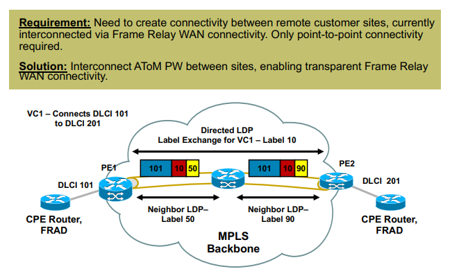

### Layer-2 VPN Summary
- Enables transport of any Layer-2 traffic over MPLS
network
- Two types of L2 VPNs; AToM for point-to-point and
VPLS point-to-multipoint layer-2 connectivity
- Layer-2 VPN forwarding based on Pseudo Wires (PW),
which use VC label for L2 packet encapsulation
LDP used for PW signaling
- AToM PWs suited for implementing transparent point-topoint connectivity between Layer-2 circuits