# Congestion control

## A simple router model

*The loads that comes in to the router is the load that should go out. THe idea with buffers is that they can handle bursts traffic. Buffers are seen as a necessary evil. We would like small queues/buffers. Jitter is even worse (low delay, high delay, low delay)*

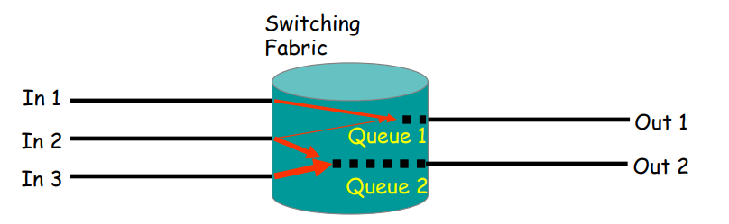

**Switch(ing) fabric** forwards a packet (dest. addr.)
if no special treatment necessary: “fast path“ (hardware)

- Queues grow when traffic bursts arrive
    - low delay = small queues, low jitter = no queue fluctuations
- Packets are dropped when queues overflow (“DropTail queueing“)
    - low loss ratio = small queues

*Congestion control came form a emergency situation, and is a quick fix that stayed*

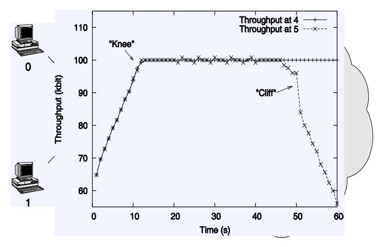

*an increase in throughput in a single link in the network can result in congestion and packet loss in the network as a whole.*

## Global congestion collapse

**Craig Partridge, Research Director for the Internet Research Department at BBN Technologies:**

*Bits of the network would fade in and out, but usually only for TCP. You could ping. You could get a UDP packet through. Telnet and FTP would fail after a while. And it depended on where you were going (some hosts were just fine, others flaky) and time of day (I did a lot of work on weekends in the late 1980s and the network was wonderfully free then).*

*Around 1pm was bad (I was on the East Coast of the US and you could tell when those pesky folks on the West Coast decided to start work...).*

*Another experience was that things broke in unexpected ways - we spent a lot of time making sure applications were bullet-proof against failures. (..)*

*Finally, I remember being startled when Van Jacobson first described how truly awful network performance was in parts of the Berkeley campus. It was far worse than I was generally seeing. In some sense, I felt we were lucky that the really bad stuff hit just where Van was there to see it.*

## Internet congestion control: history

- **around 1986:** first congestion collapse
- **1988:** __"Congestion Avoidance and Control" (Jacobson)__
Combined congestion/flow control for TCP
(also: variation change to RTO calculation algorithm)

- Idea: packet loss = congestion, so throttle the rate; increase
otherwise

-  Goal: stability - in equilibrum, no packet is sent into the network until an old packet leaves
    - ack clocking, “conservation of packets“ principle
    - made possible through window based stop+go - behaviour

- Superposition of stable systems = stable -> network based on TCP with congestion control = stable

## A control loop to stabilize
(bring it to equilibrium and keep it there)

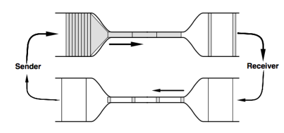
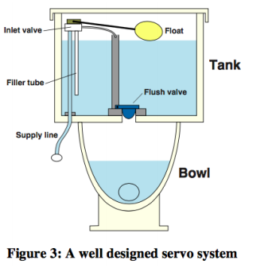

Diagrams taken from:
V. Jacobson, K. Nichols K. Poduri,
"RED in a Different Light", unpublished
– "...because someone on the program committee was offended
by the diagram explaining its behavior."
https://gettys.wordpress.com/2010/12/17/red-in-a-different-light/

## Reminder: TCP's sliding window

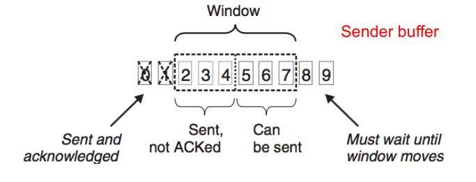

- Receiver “grants“ credit (receiver window, rwnd)
    - sender restricts sent data with window
- Receiver buffer not specified
    - i.e. receiver may buffer reordered segments (i.e. with gaps)

## TCP Congestion Control: Tahoe
- Distinguish:
    - flow control: protect receiver against overload (receiver "grants" a certain amount of data ("receiver window" (rwnd)) )
    - congestion control: protect network against overload("congestion window" (cwnd) limits the rate: min(cwnd,rwnd) used! )
- Flow/Congestion Control combined in TCP. Two basic algorithms:
    - Slow Start: for each ack received, increase cwnd by 1 packet(exponential growth) until cwnd >= ssthresh
- Congestion Avoidance: each RTT, increase cwnd by at most 1 packet (linear growth - "additive increase“)

## TCP Congestion Control: Tahoe /2

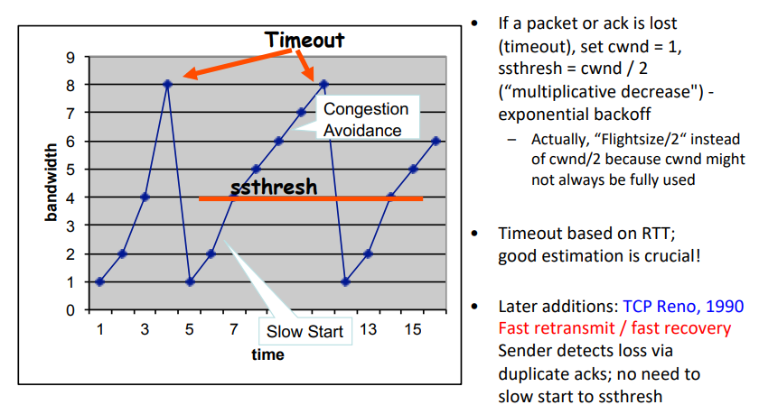

## Background: AIMD
*idea: Simplest possible ting for congestion control*
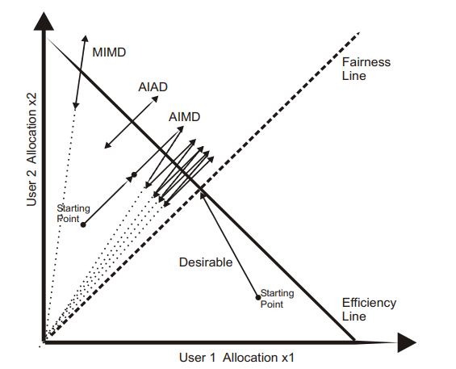

## AIMD is an easy way out, but...
Michael Welzl, Max Mühlhäuser: "CAVT - A Congestion Avoidance Visualization Tool",
ACM SIGCOMM CCR 3(3), July 2003, pp. 95-101.
http://heim.ifi.uio.no/michawe/research/tools/cavt/index.html

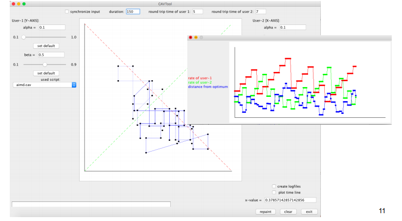

## Actual TCP (simulation)

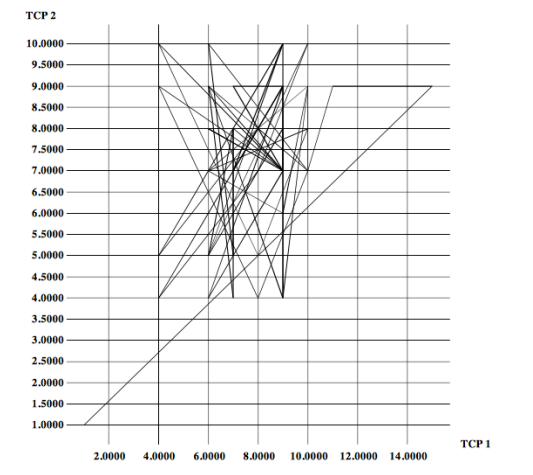

## TCP Reno: building a queue

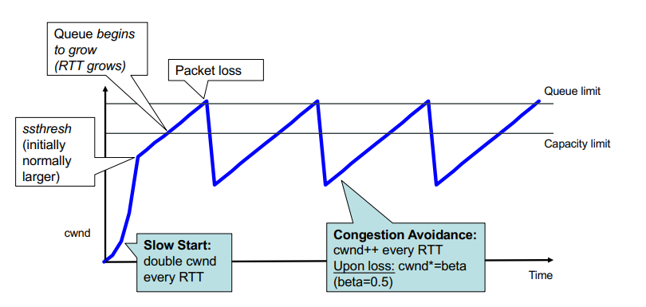

## How large should a queue be?

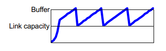

Old rule-of-thumb: “Bandwidth * delay product” (BDP)
(bw = bottleneck link capacity; delay = RTT)
- Can be unreasonably large,
causing unnecessary delay
(severe e.g. for VoIP and games)
- For core routers,
bw * RTT / sqrt(no. flows) was found to be enough
- No new rule exists for access equipment (routers, modems, ..)
Often, access link = bottleneck;
access equipment’s queue = the one that grows
- Some equipment vendors sell “large buffer = feature”
- Effect: extreme delay, now called “buffer bloat”

## Using delay as a signal

Delay grows before loss, so can react earlier, limit delay
- Noisy signal, but fine-grain and easily available
- Oldest known approach: TCP Vegas; works well but loses against Reno
LEDBAT: turning this bug into a feature
- For low-priority traffic that should not get in the way
- Encapsulation not (yet?) defined; implemented over UDP in BitTorrent

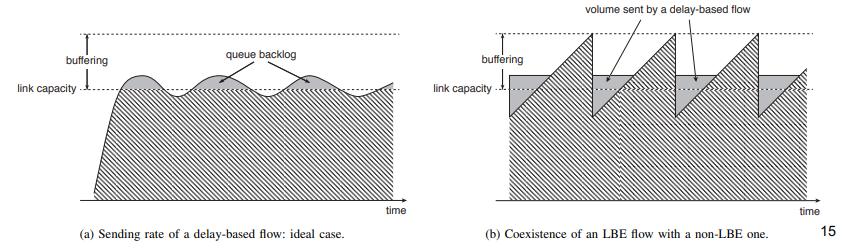

## More problems with delay as a signal

RTT easier to measure than One-Way Delay (OWD), but can be
noisy (don’t want to react to queue on return path)
- Note: absolute OWD doesn’t usually matter (clock sync not needed),
need changes of OWD

Size of buffer determines measurement granularity

Base delay (long-term min. delay) can create problems
- One flow’s congestion is the next flow’s base delay
- Need to occasionally refresh, but don’t measure yourself!

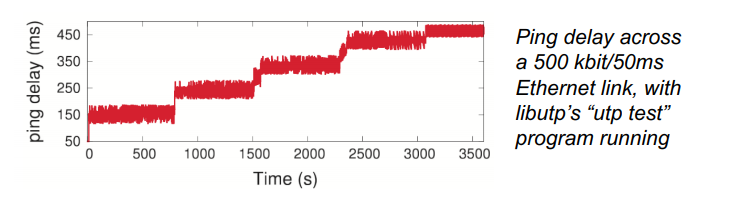