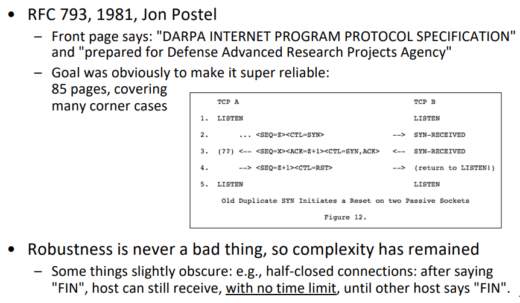
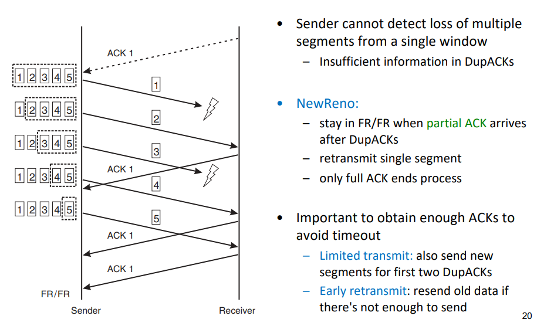
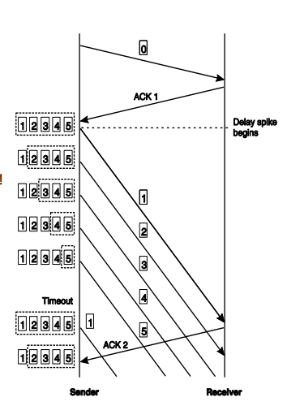

# The Internet transport layer

## The Internet transport layer

#### Services are (mostly) defined by two protocols
– UDP (connectionless): sends a “datagram”
– TCP (connection oriented): transfers a reliable bytestream

#### Addressing: port numbers
– Choosing a service during connection establishment: well-known ports

## Internet terminology
- PDU, SDU, etc.: OSI terminology
    - Internet terminology: datagram, segment, packet
- Theoretically, 1 TCP segment could be split into multiple IP packets
    - hence different words used
- In practice, this is inefficient and not often done
    - hence segment = packet

## Evolution of the Internet's transport layer
- TCP and UDP... so long that it has become almost impossible to use something else. "Ossification"
    - E.g., X/IP is a big failure unless X != {TCP, UDP}
- Try-a-different-protocol-else-fall-back hard to implement; thus, protocols now often developed in user space, over UDP, per application
    - Wheel re-invention: e.g. multi-streaming is in SCTP, Adobe's RTMFP, Google's QUIC, Apple's Minion...
    - Think "TCP++" for these protocols. Good to understand TCP first!
- IETF Transport Services (TAPS) WG: new API that lets applications choose service instead of protocol
    - Flexible protocol choice possible below
    - Try-else-fall-back complexity: not for app developer
    - ... But this is new. Let's wait and see!

*Meanwhile, we have to learn TCP and UDP.*

## UDP

- UDP = IP + 2 features:
    - Ports: identify communicating instances with similar IP address(transport layer)
    - Checksum: Adler-32 covering the whole packet
- checksum field = 0: no checksum at all
- Usage of UDP: unreliable data transmission (DNS, SNMP, real-time streams, ..)

## TCP
*How it really is today. Skipping the very basic things that you should know from IN2140.*

## The beginning (1970s, up to 1981)

## Some old things are best forgotten

- Push bit (PSH)
    Wake up receiver tread
- Urgent pointer (URG)
    Obsolete, used to tell application about important data in the packet
• Generally, maybe don’t read RFC 793…
– draft-ietf-tcpm-rfc793bis-06:
"This document obsoletes RFC 793, as well as 879,
6093, 6429, 6528, and 6691. It updates RFC 1122
(..) RFC 5961 (..)"
• Also consider: TCP spec roadmap (RFC 7414)
– And implementations diverge...

## Later 80‘s, and 90‘s
- FreeBSD was "reference" implementation
*Written by people that designed TCP*
    - Matches Stevens book; patches that were made over time were if-clauses in the code; later revamped
    - Originally, much code written by people who also wrote the RFCs (Van Jacobson, Sally Floyd Mark Allman, Matt Mathis ..)
    - Many of them also wrote ns-2 simulator code
    - These people guided the design in the IETF
- Van Jacobson "saved the Internet" after congestion collapse,
with code + SIGCOMM 1988 paper about it: "Congestion
Avoidance and Control"
- Linux implementation also common and well known in IETF,
completely different code(segment-, not byte-based)
    - Focus of Google (more later)

## Resulting IETF view
• TCP has been working for a long time, so let‘s be careful
è making it more robust is okay.
– Note: WG is called "TCP Maintenance and Minor Extensions (TCPM)"
• ...and let‘s be careful about congestion control in particular.
• Our "early heroes" did a great job, so never break their rules
è important congestion control principles:
    1. ACK clocking ("conservation of packets" principle)
    2. Timeout means that the network is empty
• But, note: the IETF also tries to stay meaningful
– Voluntary, we have no "Internet police"
– We should be happy that companies such as Google (in case of
TCP) keep coming to the IETF to tell us what they do

## TCP Header

- Flags indicate connection setup/teardown, ACK, ..
- If no data: packet is just an ACK
- Window = advertised window from receiver (flow control)
    - Field size limits sending rate in today‘s high speed environments; solution:__Window Scaling Option__ – both sides agree to left-shift the window value by N bit

*Small window for a round trip time. left shift bits to make possible bigger number for window size*

## The importance of Window Scaling

*To be able to scale the window up is super important. OSes are gradually increasing the limit*

## Error control: Acknowledgement

- ACK (“positive” Acknowledgement) serves multiple purposes:
    - sender: throw away copy of data held for retransmit
    - time-out cancelled
    - msg-number can be re-used
- TCP ACKs are cumulative
    - ACK n acknowledges everything up to n-1
- ACKs should be delayed (except when sending duplicates – why? later!)
    - TCP ACKs are unreliable: dropping one does not cause much harm
    - Enough with 1 ACK every 2 segments, or at least 1 every 500 ms (often: 200 ms)
- TCP counts bytes; ACK carries “next expected byte“ (#+1)
    - Sender sends them as "segments", ideally of size SMSS
    - Nagle algorithm delays sending to collect bytes & avoid sending tiny segments (can be disabled)

*Following slides: segment numbers for simplicity (imagine 1-byte segments)*

*Its ok to send one ACK for everyother package, ACKS dont need to be reliable. TCP uses bytes number not packet number*

## Error control: Timeout

*Remember: that's the first congestion signal. Back to square 1 (SS from cwnd=1).*

- Go-Back-N behavior in response to timeout
- Retransmit Timeout (RTO) timer value difficult to determine:
    - too long è bad in case of msg-loss; too short è risk of false alarms
- General consensus: too short is worse than too long; use conservative estimate
- Calculation: measure RTT (Seg# ... ACK#) , then:
original suggestion in RFC 793: Exponentially Weighed Moving Average (EWMA)
    - SRTT = (1-a) SRTT + a RTT
    - RTO = min(UBOUND, max(LBOUND, b * SRTT))
- Depending on variation, result may be too small or too large; thus, final algorithm includes variation (approximated via mean deviation)
    - SRTT = (1-a) SRTT + a RTT
    - d = (1 - b) * d + b * [SRTT - RTT] * That's not how Linux does it*
    - RTO = SRTT + 4 * d

*RTO is hard, we wait to short we send duplicated, we wait to long we have bad utilization*

## RTO calculation

- Problem: retransmission ambiguity
    - Segment #1 sent, no ACK received à segment #1 retransmitted
    - Incoming ACK #2: cannot distinguish whether original or retransmitted segment #1 was ACKed
    - Thus, cannot reliably calculate RTO!

- Solution 1 [Karn/Partridge]: ignore RTT values from retransmits
    - Problem: RTT calculation especially important when loss occurs; sampling theorem suggests that RTT samples should be taken more often

- Solution 2: Timestamps option
    - Sender writes current time into packet header (option)
    - Receiver reflects value
    - At sender, when ACK arrives, RTT = (current time) - (value carried in option)
    - Problems: additional header space; historical: facilitates NAT detection
- Note: because of how RTO is calculated, not much gain from sampling more than once per RTT

*Many TCP developments have with ensuring timeout does not happens, "timeouts are terrible"*

## Fast Retransmit / Fast Recovery (FR/FR) (Reno)

## Multiple dropped segments

## Selective ACKnowledgements (SACK)

- Example on NewReno slide: send ACK 1, SACK 3, SACK 5 in response to segment #4
- Better sender reaction possible
    - (New)Reno can only retransmit 1 segment / window, SACK can retransmit more
    - Particularly advantageous when window is large (long fat pipes)
- Extension: DSACK informs the sender of duplicate arrivals
- Reaction to SACK open to implementer, but must follow general CC rules
    - Next: IETF-recommended "conservative" algorithm (RFC 6675)
    - Other variant: FACK, optional in Linux; considers all "holes" as lost -> retransmit

*TCP option, let receiver send what it has received. Sender can do something more reasonable. DSACK tells about duplicate arrivels. More bugfixes...*

## SACK loss recovery: key aspects

- Explicitly estimate #bytes in flight: "pipe"
    - cwnd – pipe > 1 segment means: "allowed to send"
- Determine the ideal next segment to send
    - Retransmit only when we're really sure that a segment was lost
    - Else transmit new segments, if possible... or just do something
reasonable (better to retransmit less-sure-segments than nothing
if we're allowed to send)
- Maintain other existing TCP logic
    - DupACK interpretation
    - Limited Transmit
    - ...

## Spurious timeouts
- Possible occurrence in e.g. wireless scenarios
(handover): sudden delay spike
- Can lead to timeout
    -> slow start
    - But: underlying assumption: “pipe empty“ is wrong! (“spurious timeout“)
    - Old incoming ACK after timeout should be used to undo the error
- Several methods proposed
Examples:
- Eifel Algorithm: use timestamps option to check:
timestamp in ACK < time of timeout?
- DSACK: duplicate arrived
- F-RTO: after RTO, send one retransmit, then, if ACK advances the window, send new data; if new data gets ACKed, timeout was spurious

*An ACK you didnt expect, and you finds out afterwards*

## Appropriate Byte Counting

- Increasing in Congestion Avoidance mode: common implementation
(e.g. Jan’05 FreeBSD code): cwnd += SMSS*SMSS/cwnd for every ACK
(same as cwnd += 1/cwnd if we count segments)
    - Problem: e.g. cwnd = 2: 2 + 1/2 + 1/ (2+1/2)) = 2+0.5+0.4 = 2.9
thus, cannot send a new packet after 1 RTT
    - Worse with delayed ACKs (cwnd = 2.5)
    - Even worse with ACKs for less than 1 segment (consider 1000 1-byte ACKs) -> too aggressive!
- Solution: Appropriate Byte Counting (ABC)
    - Maintain bytes_acked variable; send segment when threshold exceeded
    - Works in Congestion Avoidance; but what about Slow Start?
        - Here, ABC + delayed ACKs means that the rate increases in 2*SMSS steps
        - If a series of ACKs are dropped, this could be a significant burst (“microburstiness“); thus, limit of 2*SMSS per ACK recommended

*A bugfix if there ever was one*

## Proportional Rate Reduction (PRR)

Generalization (any back-off factor) of Linux' Rate-Halving
- Rate-halving avoids burst + pause behavior of FACK or RFC 6675
"conservative loss recovery" algorithm; "paces" segments
- Implements, for FR, common logic: Slow Start when cwnd <\ssthresh

Example from RFC6937 (X = lost, N = new, R = retransmit):

## Next: measures to help short flows

Short flows are often interactive; latency matters
- Large bulk data transfer not usually latency-critical

- Every packet matters: drop -> retransmit -> user-perceived latency
    - Good to send much, fast (speed up slow start)
    - Shaving off round-trips: when all the data can be sent in e.g. 1 RTT, handshake latency = ½ of the time
    - Tail loss: FR can't work when no more data to send, hence no more ACK arrives
Note: short flows ≈ application-limited flows ("thin streams") (also: rwnd-limited flows!)

## Increasing the Initial Window (IW)

Slow start: 3 RTTs for 3 packets =
inefficient for very short transfers
– Example: HTTP Requests
• Thus, initial window since ~2002:
IW = min(4*MSS, max(2*MSS, 4380 byte))
(typically 3)
• Since ~2013:
IW = min (10*MSS, max (2*MSS, 14600))
(typically 10)
– Adopted in Linux as default since kernel 2.6.39
(May 2011)
– Note: cwnd after timeout
("Loss Window" (LW)) still 1

## TCP Fast Open (TFO)

Builds on T/TCP idea: allow HTTP GET on SYN,
respond with data + SYN/ACK
– There, the problem was: DoS attack surface
• Solution:
– First handshake like normal, server gives client cookie and
remembers it (locally configurable time)
– Later handshakes: SYN + data + cookie
• Remaining problem: server cannot tell original from
retransmitted SYN è application must be able to accept
duplicate data (changes semantics, also API)
– Not a big problem for a web server

## Tail loss
• Consider the "tail" of a transmission
– e.g., segments 8, 9, 10 of a total 10-segment transfer
• Segment 8 lost: we get 2 DupACKs
– If we have new data to send, Limited Transmit allows us to do
that (which will give us another DupACK and we can enter FR,
where we can retransmit)
– Else, Early Retransmit allows us to resend segment 8
• Segment 10 lost: we get no more ACKs, only the RTO
can help us...

## RTO Restart (RTOR)
• In some cases TCP/SCTP must
use RTO for loss recovery
– e.g., if a connection has 2
outstanding packets and 1 is lost
• However, the effective RTO often
becomes RTO = RTO + t
– Where t ≈ RTT [+delACK]
• The reason is that the timer is
restarted on each incoming ACK
(RFC 6298, RFC 4960)
• RTOR rearms timer as:
RTO = RTO - t

## Tail Loss Probe (TLP)

From draft-dukkipati-tcpm-tcp-loss-probe-01:
"Measurements on Google Web servers show that approximately 70% of
retransmissions for Web transfers are sent after the RTO timer expires,
while only 30% are handled by fast recovery."
"...distribution of RTO/RTT values on Google Web servers.
[percentile, RTO/RTT]: [50th percentile, 4.3]; [75th percentile, 11.3];
[90th percentile, 28.9]; [95th percentile, 53.9]; [99th percentile, 214]."
"... typically caused by variance in measured RTTs..."
• Idea: more aggressive timer allows to send one single
packet ("probe") before RTO fires
– timer: max(2 * SRTT, 10ms)
(+extra time for DelACK if FlightSize==1)
– new, if data available, else resend

## Recent ACKnowledgment (RACK)
• Main idea: use time instead of sequence numbers
(avoid basing logic on DupThresh)
– Multiple benefits: eliminates need for much loss recovery logic (drastic
simplification!), works with every packet (also retransmits), ..
• Packet A is lost if some packet B sent sufficiently later is (s)acked
– "Sufficiently later": later by at least a "reordering window"
(RACK.reo_wnd, default min_rtt / 4)
– min_rtt calc. from RTTs per ACK; tried seeding with SRTT or most
recent RTT, no major difference
• Also: arm a timer to detect loss in case no ACK arrives
– TLP is a special case; merged with RACK
– Conceptually, RACK arms a (virtual) timer on every
packet sent, times updated with new RTT samples

## RACK examples: sender sends P1, P2, P3
(more than RACK.reo_wnd time in between them)
• Example 1: P1 and P3 lost
– P2 SACK arrives -> P1 lost, retransmit (R1)
– R1 is cumulatively ACKed -> P3 lost, retransmit (R3)
– No timer needed
• Example 2: P1 and P2 lost
– P3 SACK arrives -> P1, P2 lost, retransmit (R1, R2)
– R1 lost again but R2 SACKed -> R1 lost, retransmit
– Common with rate limiting from token bucket policers with large
bucket depth and low rate limit
– Retransmissions often lost repeatedly because CC. requires
multiple RTTs to reduce the rate below the policed rate
• No DupACK based solution can detect such losses!

## Conclusion on TCP

- Note, we focused on what was implemented
    - We also skipped some things: header compression, authentication, sequence
number attacks, implementation specifics (e.g. TCP_NOTSENT_LOWAT)...
- RFC series documents many non-implemented (??) ideas from that time
    - Being more robust to reordering (TCP-NCR)
    - Doing congestion control for ACKs (ACK-CC)
    - Reducing cwnd when the sender doesn't have data to send (CWV)
    - Adjusting user timeout (when TCP says "it's over") at both ends (UTO)
    - Avoiding Slow Start overshoot for large windows (Limited Slow-Start)
- ...and some old ideas "took off" later (e.g. T/TCP, ECN)
    - Or not? Time will tell
