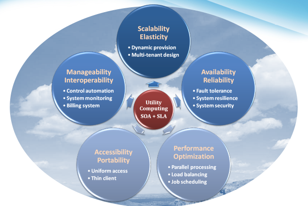

# Cloud Computing

## What is Cloud Computing
A new paradigm in computing. A new way of thinking of IT industry

#### Central Ideas
- Utility Computing
- SOA
- SLA

#### Properties and characteristics
- High scalability and elasticity
- High availability and reliability
- High manageability and interoperability
- High accessibility and portability
- High performance and optimization

#### Enabling techniques
- Hardware virtualization
- Parallelized and distributed computing
- Web service

## Central Ideas
**User dont need to know the complexities behind the scenes**

#### Perspective from user :
- Users do not care about how the works are done
    - Instead, they only concern about what they can get
- Users do not care about what the provider actually did
    - Instead, they only concern about their quality of service
- Users do not want to own the physical infrastructure
    - Instead, they only want to pay as many as they used

- What does the user really care about?
    - They only care about their “Service” and the cost

## Utility Computing

- One service provisioning model
    - Service provider makes computing resources and infrastructure management available to the customer as needed, and charges them for specific usage rather than a flat rate.

    - Like other types of on-demand computing , the utility model seeks to maximize the efficient use of resources and/or minimize associated costs.

### What Is Web Service?
Web based API for accessing services

API protocols:
- WSDL
- OpenAPI

#### Definition:
- Web service is self-describing and stateless modules that perform discrete units of work and are available over the network
- Web service providers offer APIs that enable developers to exploit functionality over the Internet, rather than delivering full-blown applications

#### Web Services Description Language (WSDL):
WSDL is an XML-based interface description language that is used for describing the functionality offered by a web service, which includes both data type and messages

## Service Oriented Architecture 

#### Definition
- Service Oriented Architecture (SOA) is essentially a collection of services which communicate with each other over a network
- Is a style of software design where services are provided to the other components by application components, through a communication protocol
- The basic principles of service-oriented architecture are independent of vendors, products and technologies

*Request Response*

## Service Level Agreement

#### Definition
A service-level agreement (SLA) is a contract between a network service provider and a customer that specifies, usually in measurable terms (QoS), what services the network service provider will furnish

#### Common content in contract
- Performance guarantee metrics
    - Up-time and down-time ratio
    - System throughput
    - Response time
- Problem management detail
- Penalties for non-performance
- Documented security capabilities

## Scalability & Elasticity

#### What is scalability ?
- The ability to increase workload size within existing infrastructure (hardware, software, etc.) without impacting performance. These resources required to support this are usually pre-planned capacity with a certain amount of headroom built in to handle peak demand.

#### What is elasticity ?
- The ability to grow or shrink infrastructure resources dynamically as needed to adapt to workload changes in an autonomic manner, maximizing the use of resources. This can result in savings in infrastructure costs overall.
- Cloud elasticity is a popular feature associated with scale-out solutions (horizontal scaling), which allows for resources to be dynamically added or removed when needed.

#### But how to achieve these properties ?
- Dynamic provisioning
- Multi-tenant design

## Dynamic Provisioning
#### What is dynamic provisioning ?
- Dynamic Provisioning is a way to explain a complex networked server computing environment where server computing instances are provisioned or deployed from a administrative console or client application by the server administrator, network administrator, or any other enabled user.

## Static Provisioning

#### In traditional computing model, two common problems :
- Underestimate the system capacity which result in under provision
- Overestimate system capacity which result in low utilization

#### How to solve this problem ??
- Dynamically provision resources

## Multi-tenant Design

#### What is multi-tenant design ?
- Multi-tenant refers to a principle in software architecture where a single instance of the software runs on a server, serving multiple client organizations.

- With a multi-tenant architecture, a software application is designed to virtually partition its data and configuration thus each client organization works with a customized virtual application instance.

#### Client oriented requirements:
- Customization
    - Multi-tenant applications are typically required to provide a high degree of customization to support each target organization's needs.
- Quality of service
    - Multi-tenant applications are expected to provide adequate levels of security and robustness.

## Availability & Reliability

#### What is availability ?
- The degree to which a system, subsystem, or equipment is in a specified operable and committable state at the start of a mission, when the mission is called for at an unknown time. 
- Cloud system usually require high availability
Ex. “Five Nines” system would statistically provide 99.999% availability

#### What is reliability ?
- The ability of a system or component to perform its required functions under stated conditions for a specified period of time. 

#### But how to achieve these properties ?
- Fault tolerant system
- Require system resilience
- Reliable system security

## Fault Tolerance

#### Single Point Of Failure (SPOF)
- A part of a system which, if it fails, will stop the entire system from working.
- The assessment of a potentially single location of failure identifies the critical components of a complex system that would provoke a total systems failure in case of malfunction.

#### Preventing single point of failure
- If a system experiences a failure, it must continue to operate without interruption during the repair process.

## Service Models

- IaaS
- PaaS
- SaaS

## Deployment models

- Public Cloud
- Private Cloud
- Community Cloud
- Hybrid Cloud

